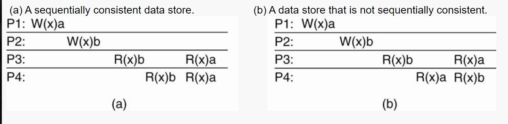
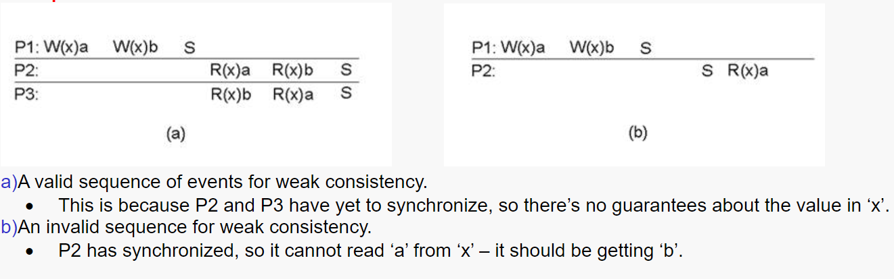
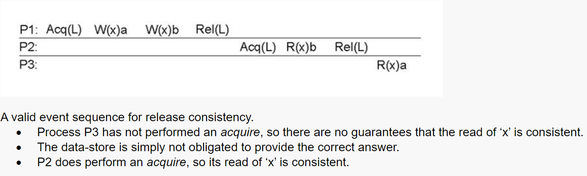
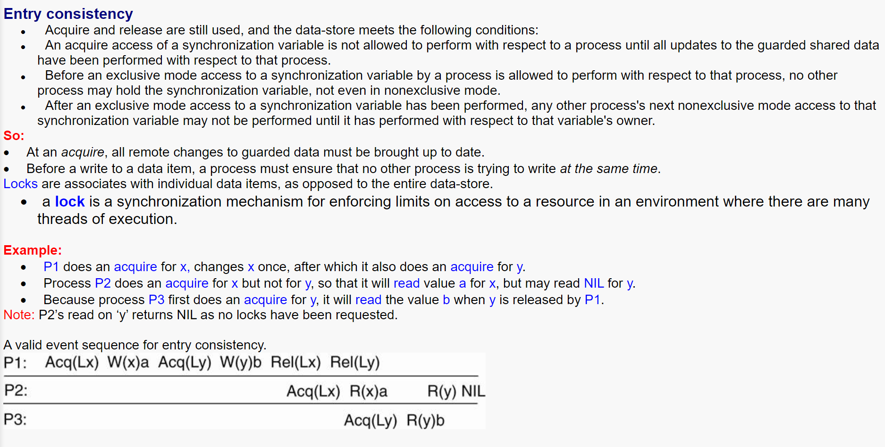
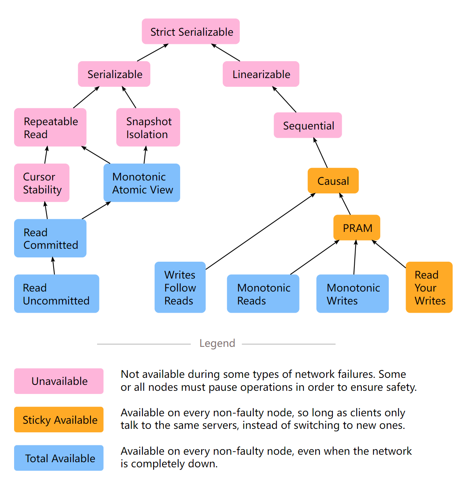

# 副本一致性

http://csis.pace.edu/~marchese/CS865/Lectures/Chap7/Chapter7fin.htm

​	为了保证副本一致性：使得所有冲突的操作（读写/读读）按照同一个顺序在多副本上来执行。

​	**一致性模型**：def：a contract between a (distributed) data store and processes, in which the data store specifies precisely what the results of read and write operations are in the presence of concurrency.（分布式）数据存储和进程之间的契约，其中数据存储精确指定并发时读取和写入操作的结果。

## 以数据为中心的一致性模型

### 不使用同步操作

#### 顺序一致性 Continuous Consistency

Conit（Consisntency unit） specifies the **data unit** over which consistency is to be measured. 

#### 严格一致性 Strict Consistency

 *Any read on a data item ‘x’ returns a value corresponding to the result of the most recent write on ‘x’ (regardless of where the write occurred).*   With *Strict Consistency*, all writes are *instantaneously visible* to all processes and *absolute global time order* is maintained throughout the distributed system.  

#### 顺序一致性 Sequential Consistency

 *The result of any execution is the same as if the (read and write) operations by all proceses on the data-store were executed in the same sequential order and the operations of each individual process appear in this sequence in the order specified by its program.* 

注：由于四个进程都是在同一台主机上执行的，所以对于写x而言要么是先写的a，要么就是先写的b；在这种情况下，读进程要么读的先后要么都是先a后b，要么都是先b后a，不能出现图b的情况。

可能的情况：

先写b后写a
P3:R(x)b		 R(x)b    P3:R(x)b		 R(x)a	P3:R(x)b		 R(x)a	P3:R(x)a		  R(x)a
P4:		R(x)b R(x)b    P4:		R(x)b R(x)a	P4:		R(x)a R(x)a	P4:		 R(x)a R(x)a

先写a后写b
P3:R(x)a		 R(x)a	P3:R(x)a		 R(x)b	P3:R(x)a		 R(x)b	P3:R(x)b 		 R(x)b
P4:		R(x)a R(x)a	P4:		R(x)a R(x)b	P4:		R(x)b R(x)b	P4:		 R(x)b R(x)b

#### 因果一致性 Casual Consistency

*Writes that are potentially causally related must be seen by all processes in the same order.*  *Concurrent writes (i.e. writes that are NOT causally related) may be seen in a different order by different processes.* 

样例：

注：由于P1与P2之间有因果关系，所以所有的读必须是先a后b，图b中取消了这个因果关系，所以读的先后顺序没了限制。

#### 先进先出一致性 FIFO Consistency

 *Writes done by a single process are seen by all other processes in the order in which they were issued, but writes from different processes may be seen in a different order by different processes.* 

### 使用同步操作

#### 弱一致性 Weak Consistency

*Accesses to synchronization variables associated with a data-store are sequentially consistent；*
*No operation on a synchronization variable is allowed to be performed until all previous writes have been completed everywhere；*
*No read or write operation on data items are allowed to be performed until all previous operations to synchronization variables have been performed.*

 *Convention: when a process enters its critical section it should acquire the relevant synchronization variables, and likewise when it leaves the critical section, it releases these variables.* 

#### 发布一致性 Release Consistency

*When a process does an acquire, the data-store will ensure that all the local copies of the protected data are brought up to date to be consistent with the remote ones if needs be.*

*When a release is done, protected data that have been changed are propagated out to the local copies of the data-store.*

#### 入口一致性 Entry Consistency

### Consistency versus Coherence

A number of processes execute read and write operations on a set of data items.
**A consistency model describes what can be expected with respect to that set when multiple processes concurrently operate on that data.**
The set is then said to be consistent if it adheres to the rules described by the model.
Coherence models describe what can be expected to only a single data item ([Cantin et al., 2005](http://csis.pace.edu/~marchese/CS865/Papers/cantin_l0663.pdf)).
**Sequential consistency model - applied to only a single data item.**

 ***Above consistency models - maintaining a consistent (globally accessible) data-store in the presence of concurrent read/write operations.*** 

## 以客户为中心的一致性模型

 前提：maintaining a consistent view of things *for the individual client process* that is currently operating on the data-store. 

 How fast should updates (writes) be made available to read-only processes? 

#### 最终一致性 Eventual Consistency

 The eventual consistency model states that, when no updates occur for a long period of time, eventually all updates will propagate through the system and all the replicas will be consistent. 

四种一致性模型：monotonic reads；monotonic writes；read your writes；writes follow reads

单调读： If a process reads the value of a data item x, any successive read operation on x by that process will always return that same or a more recent value. 

单调写： A write operation by a process on a data item x is completed before any successive write operation on x by the same process. 

读自己写：The effect of a write operation by a process on data item x will always be seen by a successive read operation on x by the same process. 

写跟随读： A write operation by a process on a data item x following a previous read operation on x by the same process is guaranteed to take place on the same or a more recent value of x that was read. 

# 副本与一致性模型

https://courses.helsinki.fi/sites/default/files/course-material/4676256/Lecture9.pdf  与上述相同

# 一致性模型

https://jepsen.io/consistency

