# 目录

## 数据库

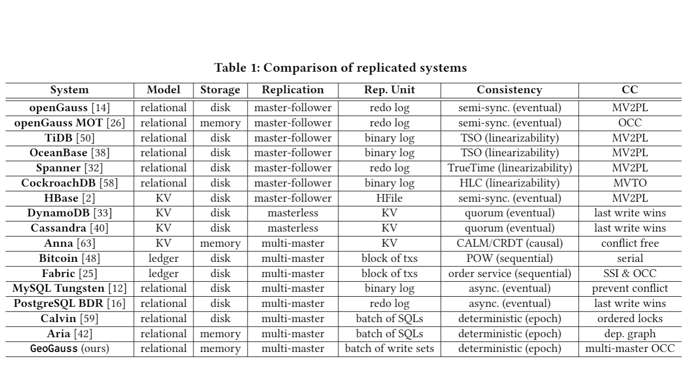

### openGauss

### Google 分布式架构

#### Chubby 分布式锁服务

 The Chubby lock service for loosely-coupled distributed systems

https://static.googleusercontent.com/media/research.google.com/zh-CN//archive/chubby-osdi06.pdf

面向松耦合的分布式系统的锁服务

​	一个Chubby集群称为一个Cell，一般由5台服务器组成，通过投票和lease租约的方式来确定和选取和维持主服务器。
​	集群中的每一个服务器都维持一份数据库副本，但只有Master能对数据库进行写操作，并通过Paxos协议同步这些写操作。

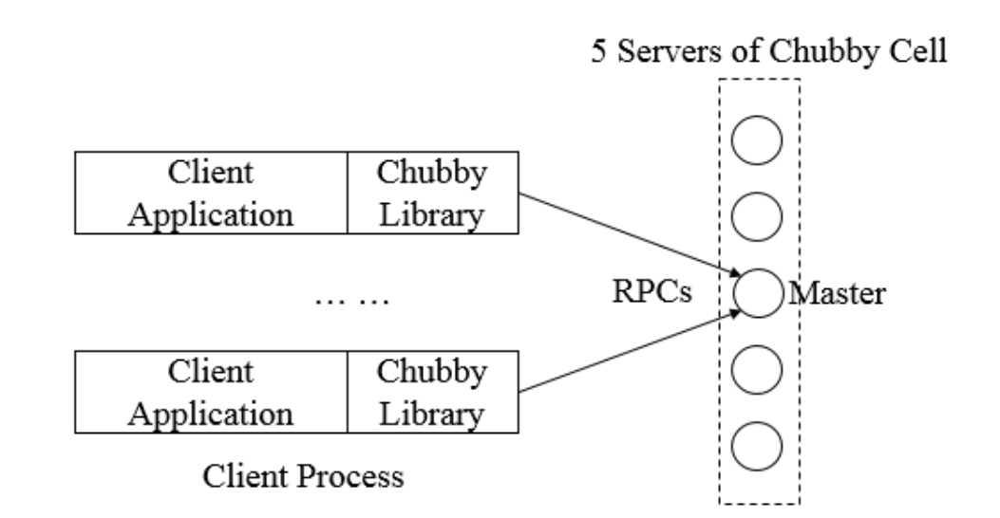

​	Chubby对外提供一套与Unix文件系统近似的访问接口，其数据结构可以看作是一个由文件和目录组成的树，数据存储路径表示为：/ls/foo/wombat/pouch, ls为所有chubby的公有前缀（lock system）foo为chubby集群的名称，client通过DNS来查找Chubby集群中的服务器ip并访问服务器；/wombat/pouch 包含业务含义的节点名字，在chubby内解析并定位到数据。

​	chubby上的节点（Node，由文件和目录组成，在一个chubby集群内唯一）可以分为持久节点和临时节点；持久节点需要显示调用API进行删除，临时节点在会话失效后自动删除；临时节点通常用来进行客户端有效性的判断依据。

​	节点包含少量元信息：4个64位的标志号（节点实例号，文件内容生成编号、锁编号、ACL编号），3个access control list（读、写、更新acl名称的权限）。

​	chubby采用锁延时和锁序列器两种策略来防止网络延时导致意外情况的发生；在客户端正常释放锁时，其他客户端可以立即获取锁，如果异常释放，则chubby为当前客户保留锁一定时间，防止网络延时造成影响。 对于锁序列器而言，其需要Chubby的上层应用配合在代码中加入相应的修改逻辑，任何时候，锁的持有者都可以向Chubby请求一个**锁序列器**，其包括**锁的名字、锁模式（排他或共享）、锁序号**，当客户端应用程序在进行一些需要锁机制保护的操作时，可以将该锁序列器一并发送给服务端，服务端收到该请求后，会首先检测该序列器是否有效，以及检查客户端是否处于恰当的锁模式，如果没有通过检查，那么服务端就会拒绝该客户端的请求。 

Chubby是Google设计的提供粗粒度锁服务的文件系统，存储大量小文件。 每个文件就代表一个锁。 在GFS中，创建文件就是进行“加锁”操作，创建文件成功的那个server其实就是抢占到了“锁”。 用户通过打开、关闭、读取文件来获取共享锁或者独占锁；并通过通信机制，向用户发送更新信息。 

#### LevelDB RocksDB KV单机数据库

https://leveldb-handbook.readthedocs.io/zh/latest/basic.html

##### LSM-Tree  Log-Structured-Merge-Tree

https://kernelmaker.github.io/lsm-tree

​	一种分层、有序，面向磁盘的数据结构，核心思想是充分利用磁盘的批量顺序写入比随机写高，一次IO进行多条数据的写入，以此进行设计和优化，以达到写信能最优（缺点：对读不友好）。

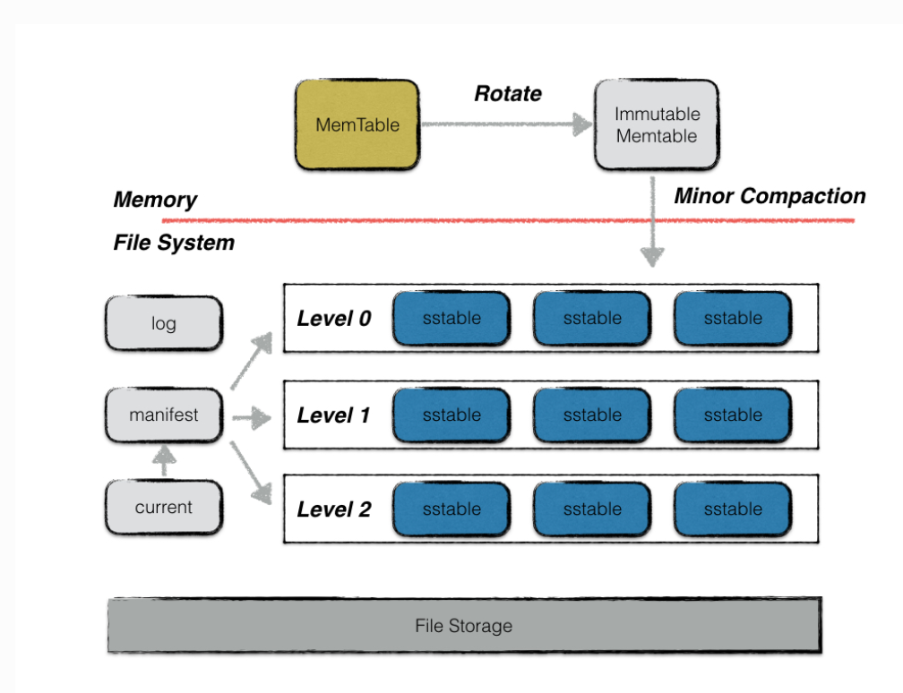

​	LSM Tree将所有的数据插入、更新、删除等操作记录（日志 log not data）保存在内存中，当操作达到一定数据量后，批量写入到磁盘中。与B+Tree不同，B+Tree是将数据直接在元数据所在处修改对应的值（多版本也许追加版本信息），但LSM Tree的数据更新是日志，数据更新是直接追加一条更新日志（记录），以达到顺序写入

​	除了利用磁盘的顺序写入之外，还划分了内存+磁盘的多层合并结构，以支持按key查询和按range查询。

核心组成：

​	**MemTable** 位于内存中的数据结构，用于保存最近更新的数据，会按照Key有序的组织这些数据（通过预写日志保证数据的可靠性）。 levelDB使用跳表数据结构构建memtable。

​	**Immutable MemTable** （只读）由MemTable到达一定大小后，转换而成，是转换成SSTable的一种中间状态，后续新的写操作由新的MemTable处理，在转存过程中不阻塞数据更新操作。

​	**SSTable** ：（Sorted String Table） **有序**键值对集合，是LSM Tree在磁盘中的数据结构。由于不同的是stable之间会有交集，levelDB定期整合这些sstable。从内存中dump出来的为level0的sstable，然后后台自动进行compaction合成的文件为leveli层文件。

​	**manifest**：存有多个版本，一个版本中记录每一层中所有文件的元信息（文件大小、最大最小key、一些compaction的统计值，控制compaction的进行），每次compaction完成后生成一个新的version。

​	**current**：记载当前的manifest文件名。levelDB在启动时会创建一个新的manifest文件，需要current指定当前的manifest文件。

​	LSM Tree通过一些大的查找结构（hash B+ tree等）将写操作顺序的报讯到一些相似的有序文件中，新的更新操作会写入新的文件中，周期性的合并这些文件来减少文件的个数（compaction basic and levelled 两种合并方式）。

​	

​	LevelDB中的每一个写操作都是追加的，形成多个版本。支持PUT、DEL、GET以及批量操作。

​	DEL即为PUT null，LevelDB中的batch结构即为Transcation。LevelDB中的key在用户的key上加上了时间戳信息。sequence number（逻辑）由LevelDB维护，每进行一个操作就累加一次。

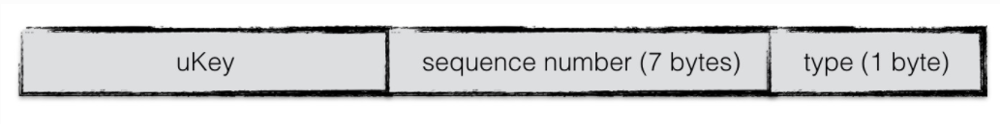

​	LevelDB**在同一时刻只允许一个写操作将内容写入到日志及内存中**，为了增加整体的写入性能，LevelDB将一些写合并：第一个写在获取到写锁后如果数据量未超过合并上限且由其他写appending时，将其他写合并到自身，然后将内容统一写入日志和内存中，然后通知其他被合并的写结果。

​	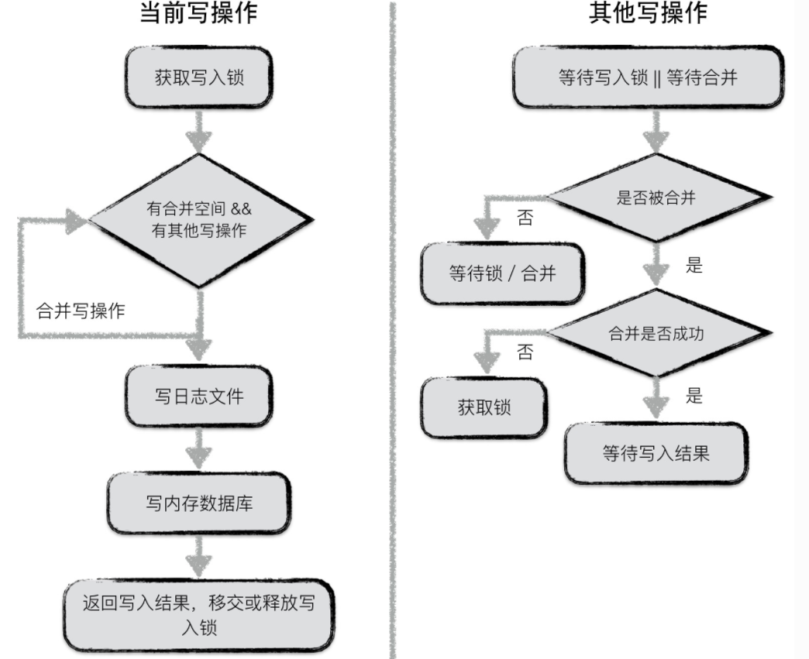

​	写入由日志保证原子性。

​	读根据key中的sequence number 从MemTable到Immuteble再到level0 sstable（由于level0 中可能存在key重叠，从最大编号的sstabl开始查找，编号大的更新）向下查找符合要求的数据。

#### GFS 谷歌文件系统

​	**The Google File System** https://static.googleusercontent.com/media/research.google.com/zh-CN//archive/gfs-sosp2003.pdf

​	集群架构

​	一个逻辑上的Master（物理上多台容灾），多台chunk服务器组成。

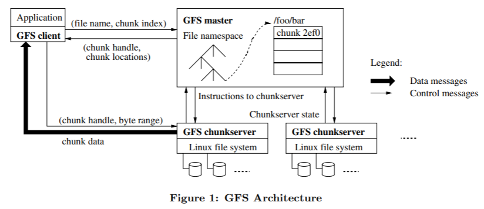

​	每个chunk（64MB）会有一个全球唯一且不变的64位chunk标识号，多副本保存。Chunk server将chunk以Linux文件的形式存储在本地硬盘上。 chunk以本地文件的方式保存，Linux操作系统的文件系统缓存会把经常访问的数据缓存在内存中。 

​	Master存储（内存）所有文件系统元信息 包括名字空间、访问控制信息、文件和Chunk的映射信息、以及当前chunk的位置信息 ， Master节点还管理着系统范围内的活动，比如，Chunk租用管理 、孤儿Chunk (orphaned chunks)的回收、以及chunk在Chunk服务器之间的迁移。
​	Master节点使用心跳信息周期地和每个Chunk服务器通讯，发送指令到各个Chunk服务器并接收Chunk服务器的状态信息。 Master在启动时或有新Chunk服务器加入时向各个Chunk服务器轮询相关信息。

​	对**文件和chunk的命名空间** 以及**文件和chunk的映射关系** 的记录会以日志方式存储在系统日志文件中，并进行多副本存储。为了加快恢复，增加checkpoint。

​	同一数据的多个chunk之间通过租约（lease）机制来保持多副本一致性。（lease机制：master向某一个chunk发送一个时间段，标志这个时间段内，当前chunk为主副本；由于时间段固定，无论master早发还是晚发或多次发送，都不影响这个时间段；）

 数据操作：
	client-->master：客户端向master询问那个Chunk服务器持有当前的租约以及其它副本的位置。如果没有Chunk持有租约，master选择其中一个建立租约。
	master将主Chunk标识符和其他副本位置返回给客户，客户和Chunk进行通信，当主Chunk不可用后，client再和master通信。
	client将数据推送到所有Chunk，然后向主Chunk发送写请求；主Chunk为这些写操作分配连续的序列号并发送到所有副本，所有副本按照这个序列有序执行。
	所有Chunk向主Chunk报告写完成后，主Chunk向客户端报告写完成。

​	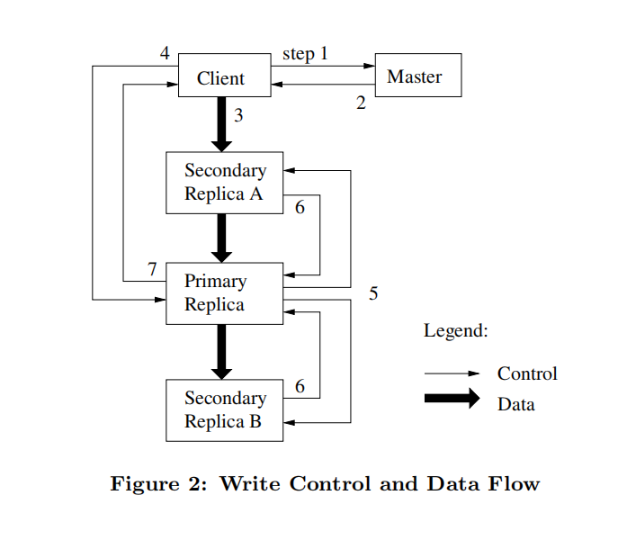

#### Percolator 分布式事务

 	一个percolator client生成多个bigtable client进行事务提交，提高并发度。

存储结构：

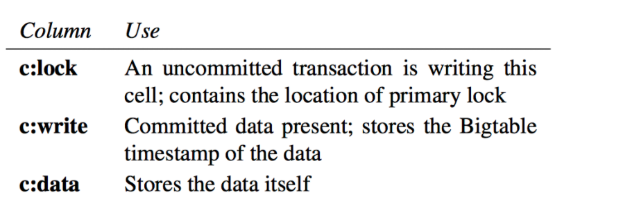

实际数据结合这三列共同决定：

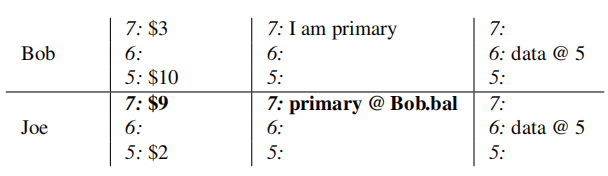

客户端先进行读和预写，生成的数据放在客户端内存中，然后通过2阶段提交协议提交事务。

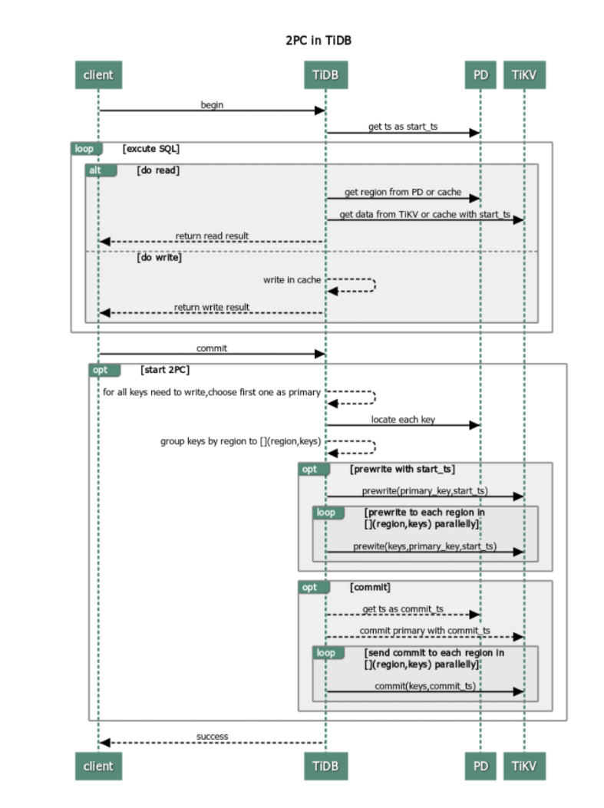

事务开始前从TSO获取start_ts,在client生成read set和write set，后进行2PC：

​	prewrite阶段：
​		事务检查是否在[start_ts,max)期间有新的数据，有则abort当前事务；
​		事务检查当前行是否被其他事务上锁，上锁则abort当前事务；
​		随后选择一列作为主列在lock上写入锁信息，data上写入数据（in-memroy中）；
​		主列/行 primary 用来判断事务是否超时，或冲突

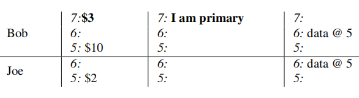	

​	Commit阶段：
​		获取主列，对其他列执行prewrite，如果其他列失败，则事务失败，成功如图所示：
​		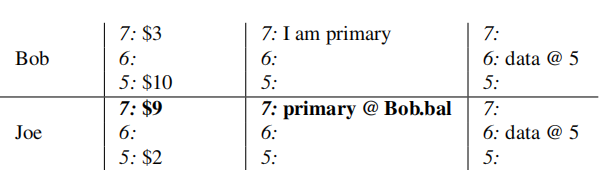

​		从TSO获取commit_ts，然后查询primary row是否有锁（没有表明因为超时被其他事务清除）
​		上述都是在内存中做的缓存，用于检测冲突。
​		对primary row进行写入，随后清除lock（此次写入为bigtable写入）
​		对其他列写入write并清除lock

#### BigTable 结构化数据分布式存储系统

​	 Bigtable: A Distributed Storage System for Structured Data https://static.googleusercontent.com/media/research.google.com/zh-CN//archive/bigtable-osdi06.pdf

​	*BigTable是一个稀疏、分布式、持久、多维的有序映射。该映射由行键（row key）、列键（column key）和时间戳（time stamp）作为索引；映射中的每一个值都是未解释的数组字节（uninterpreted array of bytes）*

​	**数据类型**

​	BigTable将数据存储在若干个表（Table）中，表中的每个Cell（数据单元）都由（row：string，column：string，time：int64）-->string来进行索引。(multi-version)

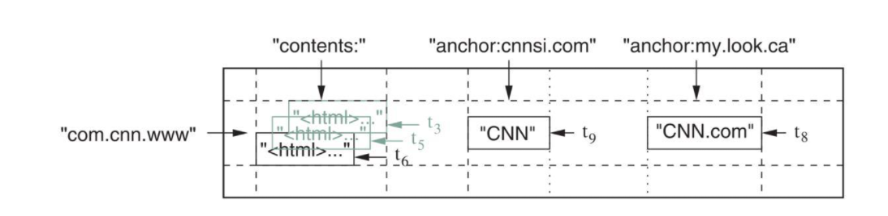

​	BigTable 在存储数据时会按照Cell的Row Key对Table进行字典排序，提供行级事务的支持。

​	BigTable将Table按照Row切分成若干个相邻的tablet，将tablet分配到不同的Tablet Server上进行存储。

​	BigTable按照若干个Column组成的Column Family（列族）对Table的访问权限控制。一个CF（column Family）中存储的数据通常为同一种数据类型。用户在使用前必须先声明Table中有哪些CF，声明后可在该CF中创建任意column。BigTable可以针对同一CF中的column进行数据压缩，允许用户以CF为单位设定数据访问权限。

​	**集群**

​	整个集群由Master和Tablet Server组成。

​	Master：利用Chubby检测集群中的Tablet Server组成以及他们的加入和退出时间；将Tablet分配给Tablet Server，并负责均衡Tablet Server键的存储负载以及从GFS上回收无用的文件；管理Table、CF的创建和删除等，Schema修改。

​	Tablet Server：负责管理若干个由Master指定的Tablet，负责处理针对这些Tablet的读写请求，并负责在Tablet变得过大时对其及进行切分。

​	元信息管理

​	Chubby file：存有Root Tablet的位置：无论该文件提价如何增大都不会被切分，确保唯一。

​	Root Tablet：保存MetaData Table中所有Tablet的位置

​	MetaData：保存其他所有Table的Tablet的位置

​	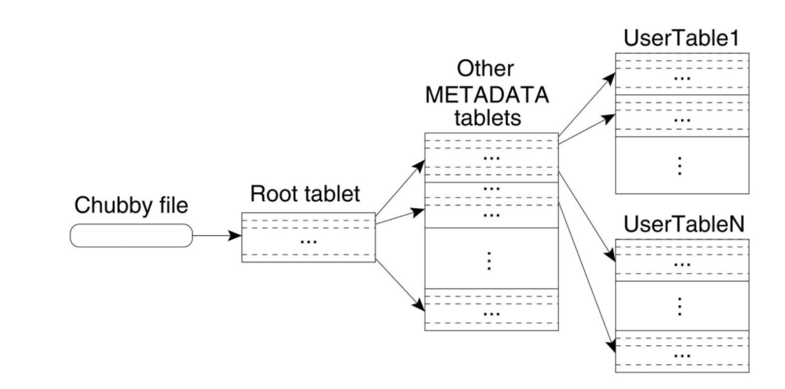

​	**Tablet读写与维护**

​	Tablet实际存储在GFS中，由GFS提供数据的冗余备份。（调用GFS的接口）

​	一个Tablet由若干个SSTable（Stored Strings Table， 一种不可修改的有序的键值映射）文件（存储在GFS中）、内存中的MenTable和一份Commit Log组成

​	写操作：先进行WAL（write ahead log），然后更新MemTbale（MenTable内部数据根据key有序排列 例如BTree），待MenTable达到一定大小后持久化为SSTable

​	**Tablet与TabletServer**

​	BigTable Master 通过Chubby来检测Tablet Server加入和离开集群事件。 每个 Tablet Server 在 Chubby 上都会有一个对应的唯一文件，Tablet Server 在启动时便会拿到该文件在 Chubby 上的互斥锁，Master 则通过监听这些文件的父目录来检测 Tablet Server 的加入。如果 Tablet Server 失去了互斥锁，那么 Master 就会认为 Tablet Server 已退出集群。尽管如此，只要该文件仍然存在，Tablet Server 就会不断地尝试再次获取它的互斥锁；如果该文件已被删除，那么 Tablet Server 就会自行关闭。 
​	 在了解了集群中有哪些 Tablet Server 后，Master 便需要将 Tablet 分配给 Tablet Server。同一时间，一个 Tablet 只能被分配给一个 Tablet Server。Master 会通过向 Tablet Server 发送 Tablet 载入请求来分配 Tablet。除非该载入请求在 Master 失效前仍未被 Tablet Server 接收到，那么就可以认为此次 Tablet 分配操作已成功：Tablet Server 只会接受来自当前 Master 的节点的请求。当 Tablet Server 决定不再负责某个 Tablet 时，它也会发送请求通知 Master。 
 	Master 在检测到 Tablet Server 失效（互斥锁丢失）后，便会将其负责的 Tablet 重新分配。为此，Master 会尝试在 Chubby 上获取该 Tablet Server 对应的文件的互斥锁，并在成功获取后删除该文件，确保 Tablet Server 能够正确下线。之后，Master 便可顺利将 Tablet 分配至其他 Tablet Server。 

#### Spanner 

Region + Zone + Servers  分布式文件系统Colossus

Spanner关于universe zone replica的关系，目前网络上说到的说google拥有三个universe，一个用于测试，一个开发、一个正常服务。一个universe就能为全球所有客户提供服务。一个Zone类似于一个BigTable实例。
对于这些介绍，我的个人理解是，google将BigTable的单Master利用TrueTime来进行提升，变成了多Master，能够在多个Zone上进行事务冲突处理。为多副本情况下，将统一数据的多个副本移动到多个Zone。
在Zone的数量比副本数要多的情况下，需要管理replice在zone上的移动，（placement driver和zonemaster处理），个人理解这种模型与TIKV和Cockroach无异（只是在事务处理上有些许不同）。

True Time 保证如果T2在T1提交后开始执行，那么T2的时间戳一定大于T1。

多副本之间通过Paxos来进行同步，不同的更新会创建多个Paxos实例，以达到高并发。

事务并发处理

### TiDB

#### 架构

开源NewSQL数据库 -->  同时支持在线事务处理与在线分析处理 (Hybrid Transactional and Analytical Processing, HTAP)  的融合型分布式数据库

详情参见TIDB整体架构：https://docs.pingcap.com/zh/tidb/stable/tidb-architecture

存储计算分离架构，行存储引擎TiKV、列存储TiFlash，TiFlash通过Mutil-Raft Learner协议实时从TiKV复制数据（数据强一致性），存算分离，动态增加并部署。

 多副本 + Multi-Raft 协议的方式将数据调度到不同的机房、机架、机器 ，当部分机器出现故障时系统可自动进行切换，确保系统的 RTO <= 30s 及 RPO = 0 ，RTO (Recovery Time Objective) 及 RPO (Recovery Point Objective IT系统崩溃后，可以恢复到某个历史时间点，从历史时间点到灾难发生的时间点的这段时间长度就称为RPO） 

​	TiDB Server：SQL 层，对外暴露 MySQL 协议的连接 endpoint，负责接受客户端的连接，执行 SQL 解析和优化，最终生成分布式执行计划 。

​	PD (Placement Driver) Server：整个 TiDB 集群的元信息管理模块，负责存储每个 TiKV 节点实时的数据分布情况和集群的整体拓扑结构，提供 TiDB Dashboard 管控界面，并为分布式事务分配事务 ID。  PD 不仅存储元信息，同时还会根据 TiKV 节点实时上报的数据分布状态，下发数据调度命令给具体的 TiKV 节点。  PD 本身也是由至少 3 个节点构成，拥有高可用的能 。

​	TiKV Server（RocksDB）：负责存储数据，从外部看 TiKV 是一个分布式的提供事务的 Key-Value 存储引擎。存储数据的基本单位是 Region，每个 Region 负责存储一个 Key Range（从 StartKey 到 EndKey 的左闭右开区间）的数据，每个 TiKV 节点会负责多个 Region。TiKV 的 API 在 KV 键值对层面提供对分布式事务的原生支持，默认提供了 SI (Snapshot Isolation) 的隔离级别，这也是 TiDB 在 SQL 层面支持分布式事务的核心。TiDB 的 SQL 层做完 SQL 解析后，会将 SQL 的执行计划转换为对 TiKV API 的实际调用。所以，数据都存储在 TiKV 中。另外，TiKV 中的数据都会自动维护多副本（默认为三副本），天然支持高可用和自动故障转移。

​	TiFlash：TiFlash 是一类特殊的存储节点。和普通 TiKV 节点不一样的是，在 TiFlash 内部，数据是以列式的形式进行存储，主要的功能是为分析型的场景加速。

​	利用Raft一致性协议，每个数据的变更都落地成为一条Raft日志，通过Raft的日志复制功能，将数据同步复制到其他节点。

TiDB Server将SQL转化成key-value，发送到TiKV中，组装TiKV的结果，返回给客户端。

TiFlash是TiKV的列存扩展，列副本通过Raft Learner协议异步复制，但是在读取的时候通过 Raft 校对索引配合 MVCC 的方式获得 Snapshot Isolation 的一致性隔离级别。 

#### TiServer

处理流程：https://pingcap.com/zh/blog/tidb-source-code-reading-3

SQL从Client发送到Server，sql语句通过Lexer转换成token交由Parser根据Yacc语法生成结构化的节点Node。
将节点进行验证（合法性检查、名字绑定）、指定查询计划并优化并构建执行计划

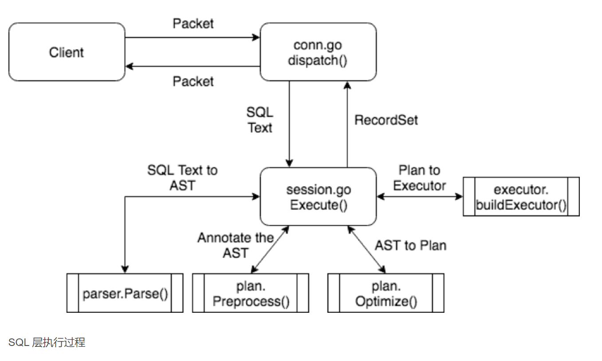

table-row -> key-value： https://pingcap.com/zh/blog/tidb-internal-2

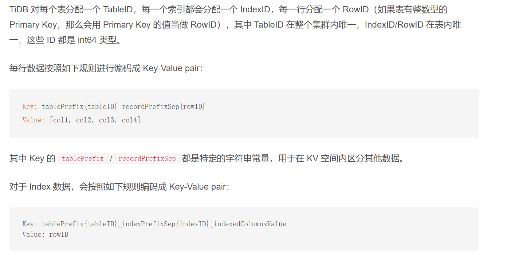

对于非unique_index : 这样能够针对每行数据构造唯一的key

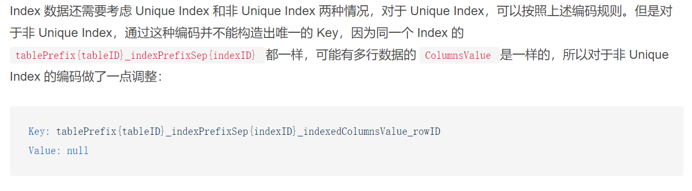

#### 分布式事务

​	TiDB 的分布式事务实现基本上与 Percolatorhttp://notes.stephenholiday.com/Percolator.pdf 论文描述一致，作为存储节点的 TiKV 利用 RocksDB Column Family （CF）功能，使用单独的 CF 来存储悲观锁以及两阶段提交中的行锁。通过 Raft 算法维护多个分片数据的一致性。
​	事务开始时向中心授时节点（Placement Driver）获取事务开始时间（start timestamp）。
​	DML 语句对自己将要修改的数据，写入一条 lock 记录到 lock cf 中。
​	prewrite 阶段检测事务冲突，并且修改 lockcf 中的 lock 类型为 2pc 行锁，同时将用户需要写入的数据写入 default cf 中（以上修改会打包成一条日志写入 raft 复制状态机中）
​	commit 阶段向中心授时节点（Placement Driver）获取事务提交时间（commit timestamp），然后将 commit timestamp 写入 commit cf 中作为数据的最新版本，并且释放 lockcf 中的锁。
​	为了保证高可用，这也就意味着 TiDB 开启了悲观事务模型后，所有的 DML 都需要写入一条额外的 raft 日志，这个操作会使得 TiDB 在事务冲突概率不高时，性能相对于乐观事务模型出现明显的下降。

**隔离级别**

标准的 Percolator 事务模型的隔离级别是 Snapshot Isolation ，然而 TiDB 在开启了悲观事务之后，隔离级别不再属于严格的 Snapshot Isolation ，因为 SELECT … FOR UPDATE 这样的查询会返回最新的结果，因此破坏了 Snapshot Isolation 的约束。

### OceanBase

系统架构（shanred nothing）

​	一个Region包含一个或多个Zone；每个Zone上回运行多个OBServer，每个Zone上包含一个副本（全功能副本或日志副本）；同一个分片或分区的多个数据副本会分布在多个Zone上，主副本所在的服务器被称为Leader，所在Zone为Primary Zone。一个Zone中只有数据的一份拷贝，中间没有数据冗余。

​	每个Zone 提供 总控服务（RootService）和分区服务（PartitionService）。 
​	每个 Zone 上都会存在一个总控服务，运行在某一个 OBServer上，整个集群（一个或多个Region）中只存在一个主总控服务，其他的总控服务作为主总控服务的备用服务运行。  总控服务负责整个集群的资源调度、资源分配、数据分布信息管理以及 Schema 管理等功能。 
​	分区服务用于负责每个 OBServer 上各个分区的管理和操作功能的模块，这个模块与事务引擎、存储引擎存在很多调用关系。 

 	OceanBase 数据库基于 Paxos 的分布式选举算法来实现系统的高可用，最小的粒度可以做到分区级别。集群中数据的一个分区（或者称为副本）会被保存到所有的 Zone 上，整个系统中该副本的多个分区之间通过 Paxos 协议进行日志同步。每个分区和它的副本构成一个独立的 Paxos 复制组，其中一个分区为主分区（Leader），其它分区为备分区（Follower）。所有针对这个副本的写请求，都会自动路由到对应的主分区上进行。主分区可以分布在不同的 OBServer 上，这样对于不同副本的写操作也会分布到不同的数据节点上，从而实现数据多点写入，提高系统性能。 

在SQL引擎层生成分布式执行计划。

多副本日志同步

​	Paxos组成员通过Redo Log的多数派强同步来确保数据的持久化。redo log包含commit log （记录数据库中数据所做的更改操作，提供数据持久性保证）和index log（记录相同分区相同log ID的已经行程多数派日志的commit log的位置信息）

 OceanBase 数据库的存储引擎基于 LSM Tree 架构，将数据分为静态基线数据（放在 SSTable 中）和动态增量数据（放在 MemTable 中， BTree 和 Hashtable 组成 ）两部分，其中 SSTable 是只读的，一旦生成就不再被修改，存储于磁盘；MemTable 支持读写，存储于内存。数据库 DML 操作插入、更新、删除等首先写入 MemTable，等到 MemTable 达到一定大小时转储到磁盘成为 SSTable。在进行查询时，需要分别对 SSTable 和 MemTable 进行查询，并将查询结果进行归并，返回给 SQL 层归并后的查询结果。同时在内存实现了 Block Cache 和 Row cache，来避免对基线数据的随机读。 

事务模型：**Large-scale Incremental Processing Using Distributed Transactions and Notififications** 
http://notes.stephenholiday.com/Percolator.pdf

#### OceanBase 中的分布式事务实现

​	OceanBase 中的分布式事务尽管也参考了 Percolator 的设计，但是 OceanBase 的开发者认为，Percolator 将底层的数据存储引擎视作一张简单的大表（BigTable），然后仅仅利用 BigTable 提供的一些简单接口来实现复杂的事务，这样的设计尽管简单便于理解，也易于开发，但是对上层屏蔽了存储层的细节，带来了额外的开销。 因此 OceanBase 对于所有尚未提交的事务都在内存中通过类似哈希表的结构维护了上下文，可以通过 transaction id 或者说 partition key 索引到这些尚未提交的事务，这样可以避免直接访问存储引擎带来的额外的开销。

**悲观锁**

​	OceanBase 尽管也采用了 LSMT 架构的存储引起，但是并没有像 TiKV 那样采用分层设计的思想，而是让事务层直接操作 Memtable，Memtable 的设计对事务层完全透明，而不是简单的 kv 结构。当用户发送的 DML 语句需要修改数据时，OceanBase 会对要修改的数据在 Memtable 中对应的 MvccRow 加上锁。也就是说 OceanBase 中没有 lockcf 和 writecf 的概念，对于同一行用户数据，加锁和写入数据都是操作的 Memtable 中的同一个对象。这里所加的悲观锁不会通过 Paxos 算法持久化到日志。

**死锁**

​	OceanBase 对于死锁的处理较为简单，如果一个事务等待锁的时间过长，会让事务直接失败并且返回超时。与之相反，TiDB 则选择了使用一个中心阶段来检测全局的悲观事务死锁。

Failover

​	由于悲观锁本身并没有持久化到日志中，因此如果出现了节点故障，之前所加的悲观锁会丢失，OceanBase 在选举出了新的主节点之后，会重新回放日志，如果事务此时处于 prepare 阶段，那么 OceanBase 会访问其 primary 节点来判断事务是否已经在所有参与者上都持久化成功，倘若所有参与者都已经持久化成功，则再次提交该事务。对于还没有进入到 prepare 阶段并且丢失了悲观锁的事务，事务会失败。为了防止其他事务与未提交的事务发生写入冲突，OceanBase 需要在处理完日志中的未提交事务后，才能提供服务

**悲观锁与调度**

​	作为一个分布式数据库，负载均衡是难以避免，而且 OceanBase 采用了和 Spanner、TiDB 类似的数据分区策略，因此当某个分区的数据膨胀之后，也不可避免地需要分裂。通过上面的分析我们知道， OceanBase 的悲观锁并未通过 Paxos 日志复制给所有的副本，因此主节点如果直接切换走，会导致悲观锁丢失从而让事务失败。为了保证事务的成功率，OceanBase 将 Leader 切换分成了两阶段，第一阶段，检查所有正在运行，且没有开始执行 prepare（OB 称之为 prepare）阶段的事务，将这些事务目前修改的数据写入日志复制到多数，然后阻塞新的事务添加悲观锁。第二阶段，转移 leader 到新的节点上，并且回放日志，将悲观锁写入内存中。

**2PC**

​	在 TiDB 的事务模型中，在 prewrite （prepare）阶段需要检查每一个 key 上的悲观锁是否为本事务所有。但是在 OceanBase 的事务模型中可以省略这一检查，因为只要 transaction id 对应的上下文仍然在内存中并且状态正确，那么就可以直接开始提交 prepare 日志。

​	这里有一点不明白，OB 写入数据到 Memtable 时是通过注册一个回调函数到目标位置，然后将回调函数放入事务上下文中，最后一起执行修改的每一行的回调函数，不知道是不是为了保证数据一致生效。按理来说 prewrite 阶段就已经写入了 MvcccRow 对象，Commit 阶段应该不需要再次查询 B Tree ，就可以直接修改对象的内存属性变为已提交。

​	尽管 OceanBase 宣称其写事务并不会阻塞读事务，但是为了保证一致性，当查询事务查询到一条加了行锁，并且处于 prepare 阶段的数据时，仍然需要等待这条数据所属于的事务完成提交或者回滚。

​	OceanBase 在进行两阶段提交时，只要 prepare 阶段的所有参与者回复确认就可以返回成功给客户端，而不需要等到 commit 日志落盘，这一设计在 TiDB 中也有类似的实现，参考 [Async Commit ](https://link.zhihu.com/?target=https%3A//pingcap.com/zh/blog/async-commit-principle)。由于 Leader 节点上早在 commit 阶段之前的步骤就可以定位到需要写入的行，因此可以提前将修改暂存在 callback 中，这样等到事务结束的时候可以通过 callback 直接更新对应行的版本（OceanBase 通过链表将多个历史版本的数据链接到一起，因此这个操作仅仅相当于一次链表的修改）。

### CockroachDB

详情参考：https://www.cockroachlabs.com/docs/stable/architecture/overview.html

底层存储为KV，通过Key-Range进行分片、默认三副本，主从副本，通过Raft协议，在提交写入之前根据他们的Raft日志协议达成一致。

Raft Log 对于每个Range，都有一个所有副本都认可（所有副本都是一致）的按照时间先后顺序的写日志。-->同步复制

SQL层-->事务层-->分布式层-->复制层-->存储层

事务层：对于写操作，有两种锁，一个是节点上（处理事务冲突），一个是副本上的写锁（维护原子性）；一般情况下读取主副本数据（强一致性），允许通过使用as for system time读本地旧副本；事务如果被abort，则会被重启；
concurrency manager：对传入的请求进行排序；lock table：每个节点存储的位于内存的数据结构，每个锁对应一个队列，事务在队列中排队，；latch manager（互斥锁）

分布式层开始：元信息存储（meta1和meta2两级，先查找cache，再找meta2，再meta1。meta1为分布式存储并使用gossip协议同步）；找到位置后，使用gRPC协议+protobuf通信

复制层：使用Raft协议，leader节点将KV操作转换为Raft命令，然后提交Raft命令并写入Raft日志。无投票权副本（提供低延时读）

存储层：将Raft日志中的写入提交到磁盘。使用Pebble和RocksDB提供在磁盘上的读写；MVCC和HLC

### HBase/BigTable

Google BigTable的开源实现；NoSQL数据库：Zookeeper作为分布式的协调、HDFS为底层文件系统、RegionServer为数据节点，存储数据、Master RegionServer监控集群中的RegionServer实例

 在 Bigtable 中，数据是按照键的顺序存储的，数据存储的单位都是 tablet，每一张表都由多个 tablet 组成，而每一个的 tablet 都有一个 tablet 服务器来处理，而 tablet 的位置都存储在 METADATA 表中。 

 在 Bigtable 中，所有的 tablet 都在 GFS 中以 SSTable 的格式存储起来，这些 SSTable 都被分成了固定大小的块在 chunkserver 上存储，而每一个块也都会在存储在多个 chunkserver 中。 

### DynamoDB

NoSQL数据库、一致性哈希,将负载合理分配到不同的存储节点上，分片、最终一致性、去中心化，NRW（Read + Write > N）、向量时钟、Gossip协议

 Dynamo 使用了 Quorum 一致性协议来保证系统中的一致性，协议中有两个可以配置的值：R 和 W，其中 R 是成功参与一个读请求的最小节点数，而 W 是成功参与写请求的最小节点数。 

故障处理难。

 为了快速确认多个副本之间的数据的一致性并避免大量的数据传输，Dynamo 使用了 [Merkle tree](https://en.wikipedia.org/wiki/Merkle_tree) 对不同节点中的数据进行快速验证。 

### Cassandra

Apache Cassandra基于Amazon Dynamo的分布式设计和Google BigTable的数据模型由Facebook创建。

### Anna

kv 无协调 最终一致性

### BitCoin

区块链技术：一种安全共享的去中心化的数据账本。将数据存储在区块中，每一个区块与前一个区块连接，组成链状结构。

- **中心化信任：**很多企业之所以采用区块链技术而不是其他数据存储技术，主要原因就是区块链不依赖中央权威就能保证数据完整性，即基于可靠数据实现去中心化信任。
- **区块：**区块链顾名思义就是将数据存储在区块中，然后每一个区块都与前一个区块连接，组成链状结构。它仅支持添加（附加）新的区块，一旦添加，就无法修改或删除。
- **共识算法：**共识算法负责区块链系统内的规则执行。当各参与方为区块链设置规则后，共识算法将确保各方遵守这些规则。
- **区块链节点：**区块链节点负责存储数据区块，是区块链中的存储单元，可保持数据同步和始终处于最新状态。任意节点都可以快速确定是否有区块发生了变更。当一个新的全节点加入区块链网络时，它会下载当前链上所有区块的副本。而当新节点与其他节点同步并更新至最新的区块链版本后，它可以像其他节点一样接收任意的新区块。

区块链节点可分为两大类：

- **全节点：**存储区块链的完整副本。
- **轻节点：**仅存储最新区块且可在用户需要时请求较旧的区块。

区块链分类

- **公共区块链：**任何人都可以不受限制地加入公共或无许可区块链网络。在现实中，绝大多数类型的加密货币都在由规则或共识算法控制的公共区块链上运行。
- **许可区块链：**专有或许可区块链允许企业控制哪些人可以访问区块链数据，即只有获得授权的用户才能访问特定数据集。Oracle 区块链平台就属于许可区块链。

### Fabirc

### 联盟链

​	联盟链，只针对特定某个群体的成员和有限的第三方，内部指定多个预选的节点为记账人，每个块的生成由所有的预选节点共同决定，其他接入节点可以参与交易，但不过问记账过程，其他第三方可以通过该区块链开放的API进行限定查询。为了获得更好的性能，联盟链对于共识或验证节点的配置和网络环境有一定要求。有了准入机制，可以使得交易性能更容易提高，避免由参次不齐的参与者产生的一些问题。 

### MySQL Tungsten

高性能、开源的数据复制引擎，用于MySQL、PG和Oracle数据库

### PostgreSQL BDR

无主 

### Calvin

 传统分布式事务处理使用到了锁来保证并发竞争的事务满足隔离级别的约束 ， 比如，序列化级别保证了事务是一个接一个运行的。而每个副本的执行顺序是无法预测的，但结果是可以预测的。  Calvin 的方案是让事务在每个副本上的执行顺序达到一致，那么执行结果也肯定是一致的。  这样做的好处是避免了众多事务之间的锁竞争，从而大大提高了高并发度事务的吞吐量。同时，节点崩溃不影响事务的执行。因为事务执行步骤已经分配，节点恢复后从失败处接着运行该事务即可，**这种模式使分布式事务的可用性也大大提高**。 

### Aria

### GeoGauss

 在BigTable系统中每个tablet服务器是没有副本的，完全依赖底层GFS把数据存到多台机 器上。数据的读写都通过单个tablet服务器，在tablet服务器出现故障的时需要master服务器将tablet指派到其他tablet服务器上才能恢复可用。Dynamo系统则贯彻了“去中心化”的思想，将数据保存在多个副本上，每个副本都可以写入update everywhere。而不同副本同时写入的数据可能会存在不一致，则需要使用版本向量version vector记录不同的值和时间戳，由应用去解释或合并不一致的数据。尽管Dynamo系统还提供了NWR的方式来支持有一致性保证的读写操作，但总的来说Dynamo为了高可用性牺牲了一致性。ZooKeeper、MongoDB与Chubby、Spanner类似，通过leader选举协议从多个副本中选择一个leader，所有写操作都在经过leader节点序列化后，同步到其他副本上。ZooKeeper则是在写入大多数节点后返回，而 MongoDB主要采用异步的主从复制方式。 

### Aurora

​	云原生数据库、存算分离架构

​	架构：以AZ为服务单元，在AZ出现错误时，不会影响到其他AZ正常提供服务、

​	Quorum 读写服务协议 Vr + Vw > V(6) Vw > V/2,

​	计算端将log发送到存储端，无需发送脏页，减少网络传输压力；存储端回放日志，

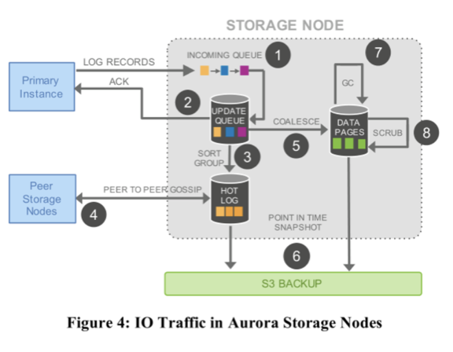

最新实现：支持多主：zero fail-over time	
		将部分并发控制下方到存储端来进行

## 数据库内核

#### 	数据库执行引擎

#### 	数据库存储引擎

​	B树类、LSM类

Oceanbase Calvin 分片部署和Spanner CockroachDB 分片部署方式

## To Be Continue