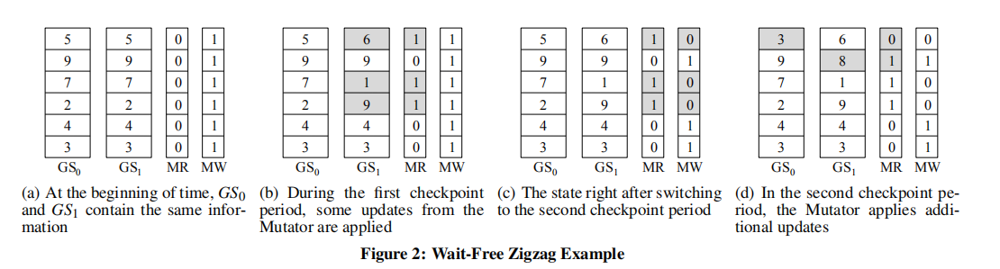

# Systems

## 	BLAZES

​	a cross-platform programanalysis framework that (a) identififies program locations that require coordination to ensure consistent executions, and (b) automatically synthesizes application-specifific coordination code that can signifificantly outperform general-purpose techniques.

		Blazes功能：Blazes分析分布式系统的基于数据流的模型（基于组件及其交互） ， Blazes找出需要协调的地方，并生成执行该协调所需的代码。 

 		BLAZES利用的关键直觉是，即使组件是顺序敏感的，也常常可以在不牺牲一致性的情况下避免全局排序的成本。在许多情况下，BLAZES可以通过一个更高效、更易于管理的协议（生产者和消费者之间的异步点对点通信，称为sealing）来确保一致的结果，该协议指示流的分区何时停止更改。 

### 1. 系统模型

 	使用数据流图来表示分布式服务:图中的节点对应于服务组件，服务组件公开输入和输出接口，这些接口对应于服务调用或其他消息事件。 

​		逻辑流： 表示软件结构，描述组件如何通过API调用进行交互 

​		物理流：表示物理结构， 将软件组件映射到它们将在其上执行的物理资源 

​		使用逻辑流 描述分布式服务的一致性语义 。

 		组件是一个可能有状态的计算单元，处理输入和输出流。并 假设组件是确定性的:一个给定组件的两个实例以相同的顺序接收相同的输入，产生相同的输出，并达到相同的状态。 

 		逻辑流(描述了在组件之间流动的消息的类型)，流实例(对应于组件实例之间的物理通道)。 

​		流是无限的、无序的消息集合。组件和流是逻辑结构，可以物理地体现在多个实例中。模型的另一个重要部分是在流中嵌入标点符号的能力（支持windows）。 

​		 标点符号保证生产者不会在流的特定逻辑分区内生成更多的消息。 

### 2. 数据流一致性

​		容错使用复制或回放，利用状态或计算的冗余来恢复组件的失败或信息的丢失。冗余需要考虑一致性，不确定的消息顺序会导致在回放或复制时流内容的不一致。这个不一致破坏了容错机制的透明性，并且难以debug。

图片展示了右侧是可能出现的异常类型，左侧的分发策略和中间组件属性用来补救，例如不确定顺序（orders ND）可以用M1策略来避免。

#### 2.1. 异常类型

​	第一个最不严重的是输入流顺序的不确定导致的输出流的不确定性（异步）。 因为很难控制组件输入出现的顺序，所以第一个(也是最不严重的)异常是输出内容的非确定性(否则就是确定性的)顺序(异步)。 

​	论文关注剩余三种异常：

​	*Cross-run nondeterminism* (**Run**)： 组件在相同输入上的不同运行中产生不同的输出流内容 。这种错误，系统无法支持回放机制的容错。

​	Cross-instance nondeterminism* (**Inst**) 相同组件的复制实例在相同输入的相同执行中产生不同的输出内容。  跨实例的不确定性可能导致查询之间的不一致 。

​	*Replica divergence* (**Diverge**) 多个副本的状态变得永久不一致 。 有些服务可以容忍流之间的暂时不一致(例如，对应于只读查询结果的流)，但是永久的复制发散是不可取的 。

####  2.2. 单调性，汇合性和收敛性 

​	CALM理论： 在单调逻辑中表达的程序产生确定性的结果，尽管在交付顺序中存在非确定性 。 运行单调代码的副本最终总是一致的，而重复播放单调代码会在每次运行中产生相同的结果。 

​	汇合性：一个数据流组件不管输入顺序如何，输出结果集（set）总是相同的。 汇流是组件行为的一种性质——单调(程序逻辑的一种性质)是汇流的一个充分条件。 与分布式中的收敛类似。

​	收敛性： 如果在所有消息都已传递之后，所有副本都认同存储的值集，则系统是收敛的或“最终一致的” 。

#### 2.3. 协调策略

 	 如果一个组件使用单调逻辑（如CALM定理中提出的），那么它将产生确定性的结果，尽管输入顺序是非确定性的。这听起来像是一件很有用的事情，知道什么时候需要多少协调。

​	对于不汇合的组件，我们可以使用排序或密封（禁止组件生成输出，直到它们的所有输入都到达为止，与标点流一起使用）。 

​	假设组件是确定性的，可以通过删除组件输入顺序中的非确定性来防止程序运行内部或跨程序运行的不一致输出。

​	 方式：(a)建立一个单一的总顺序，在这个顺序中给定组件的所有实例接收消息(一个排序策略)和(b)不允许组件生产输出，直到他们所有的输入都到达(一个密封策略)。但 两者都不会直接导致实际的协调执行 。

​	 密封策略——适用于输入流划分与组件语义兼容时——可以排除所有非确定性异常 

#### 2.4. 查询样例

 THRESH是汇合性的:我们期望它产生一个确定性的结果集，而不需要协调，因为计数的值单调地增加，不受消息到达顺序的影响。 

POOR由于是非单调的，副本可以通过协调执行全局消息传递顺序来保持同步，但这种方法会导致重大的延迟和可用性成本。 

WINDOW 通过阻塞 没太懂。。。

windowing strategy  是sealing的特殊样例。campaign，使用标点隔离。。。迷。。

### 3. 带注释的数据流图

 在Blazes模型中，组件被注释为合流（C）或顺序敏感（O），以及只读（R，无状态）或写路径（W，有状态）。

CR注释表示通过组件的路径是汇合的和无状态的；也就是说，不管其输入顺序如何，它都会生成确定的输出，并且其输入不会修改组件的状态。CW表示一条合流且有状态的路径。注释ORgate和OWgate分别表示无状态或有状态的非汇合路径。

可选的门下标标识用作分区键的属性，以标识组件在其上操作的分区。例如，CRDTs将被建模为CW。 

流可以用Seal（key）注释进行注释，该注释指示流被标点在流属性的子集键上。Rep注释指示复制流。

 Taint表示组件的内部状态可能会被无序的输入破坏 

 NDReadgate表示输出流可能具有瞬态的不确定性内容。 

分别讲述了组件的注释、流注释以及流出流标签

 BLAZES使用组件和流注释来确定给定的数据流是否保证产生确定性的结果;如果不能保证，就用协调代码对程序进行扩充。 

### 4. 协调分析和综合

规则1，2反应了不确定顺序的输入流对顺序敏感组件的影响

 Taint表示组件的内部状态可能会被无序的输入破坏 

 NDReadgate表示输出流可能具有瞬态的不确定性内容。

 规则3捕获了跨实例非确定性和副本分歧之间的交互:如果流修改了下游的组件状态，复制流之间的暂时分歧可能会导致永久性的副本分歧。 

规则4测试谓词是否兼容，以确定密封输入流何时与有状态的、非融合的组件兼容。

#### 4.1. 分析：

​	排除无限路径：枚举所有源汇对的路径，将图中的环折叠成单个节点并用环中最严重的标签标记这个节点

​	1.对于输入流被标记的组件，blazes对经过组件的每个路径进行推理（inference）图9。 组件的每个输出接口都与一组派生流标签相关联(对于来自输入接口的每个不同路径至少有一个，以及推理规则引入的中间标签) 

​	2.协调过程（*reconciliation* procedure 图10）没懂。。。

 	3.最后，每个输出接口的标签合并为单个标签。此输出流成为数据流中下一个组件的输入流，以此类推，直到所有输出流都被标记。 

 Blazes使用组件和流注释来确定一个给定的数据流是否保证产生确定的结果；如果它不能保证这一点，它就用协调代码来扩充程序。

当Blazes发现异常的可能性时，它选择了避免异常所需的最小协调策略。

Blazes将通过限制消息如何传递到某些组件来自动修复不合流或不合流的数据流。在可能的情况下，BLAZES将识别密封流和组件语义之间的兼容性，综合一种避免全局协调的基于密封的策略。否则，它将强制向这些组件传递消息时的总顺序。 

生产者和消费者之间的异步点对点通信，称为sealing，来确保一致的结果，该协议指示流的分区何时停止更改。

一个window就相当于是广告服务里面的一个分区，当一个窗口停止使用，信息停止更新，这个分区的信息不会再发生变化，就可以进行接下来的统计或查询操作了；窗口未停止使用，那么就将这条路径阻塞起来，等窗口停止后再加入到统计信息里面。这样就不会造成一致性错误了。什么时候窗口停止是通过sealing来传递消息的。

## DottedDB

 Anti-Entropy without Merkle Trees, Deletes without Tombstones

 a Dynamo-like key-value store, which uses a novel node wide logical clock framework：

 (1)最小化跟踪因果关系所需的每个键元数据，即使在节点流失的情况下也能避免其增长;(2)正确持久地删除键，不需要墓碑;(3)提供了一种轻量级的反熵机制来收敛复制数据，避免了Merkle树的需要。 

Deletes without Tombstones 

*Node-wide Dot-based Clocks (NDC)*

基于节点的时钟(NDC)是一种用于分布式、分区和复制数据库的通用框架。它假设有一个无主节点集合，其中任何一个节点都可以处理客户机请求，而不需要分布式锁定或全局协调。它的目标是:(a)减少每个对象存储的因果元数据的数量，即使是在节点搅动的情况下;
(b)提供一种因果安全的方式来删除对象，而不需要墓碑;提供一个轻量级的反熵协议利用逻辑时钟。

 

每当一个节点协调客户端更新本地对象(包括删除)的请求时，它通过将节点id与一个节点宽单调递增的计数器配对，生成一个新的全局唯一标识符 ：

*Every update has a globally unique identififier (Dot):* Every time a node coordinates a client request that updates a local object (including deletes), it generates a new globally unique identififier, by pairing the node id with a node-wide monotonically increasing counter

##          PVEs Concise version vectors in winfs  

​    WinFS是微软提出的新一代文件系统，系统不兼容fat32，具有很好的存储，检索特性，并且还能够从不同的数据中心读取数据。因为如果在分布式系统下，数据会有多个副本，副本之间通过版本向量进行控制，但是版本向量的数量是：对象数*副本数量，这在大数据量的情况下，是很糟糕的。文章针对WinFSB提出了一种新的向量，叫做*predecessor vectors with exceptions* (简称PVEs)，和传统方法相比，效率显著提升。  

 	在允许同步在不中断通信的情况下完成的情况下，一对副本只需要对每个副本进行恒定位数的通信，以检测其状态的差异。此外，它们只需要为每个对象维护一个计数器，以确定对象版本的因果顺序，并检测并发更新产生的任何版本冲突。 

​	 方法：该模式不是对不同的对象使用单独的计数器，而是使用一个每个副本的计数器来枚举副本在所有对象上生成的版本(计数器跨所有对象)。 . An object version is a pair <replica*,* counter>. Instead of using separate counters for distinct objects, the scheme uses one per-replica counter to enumerate the versions that the replica generates on all objects (the counter is across all objects).

​	Each object has, in addition to its version, a predecessor set that captures the versions that causally precede the current one. Predecessor sets are captured in PVE using version vectors, though we will show momentarily that, in most cases, PVE can replace these vectors with a null pointer.

​	When a replica A generates a new object version, the PV associated with the new version contains the latest versions known by *A* on the object from each other replica.

PV：（<replica*,* counter>,<replica*,* counter>...）

理解：每个副本中的object都有一个PV，单个副本中的object使用这个副本中的全局conter来更新PV中的conter， 

A副本 更新o1 （<A*,* 1>,<B*,* 0>，<C*,* 0>）

​			更新o2（<A*,* 2>,<B*,* 0>，<C*,* 0>）

B副本  更新o1 （<A*,* 1>,<B*,* 1>，<C*,* 0>） 通过比较PV和副本上的conter得知，副本B上的o1是最新的。

A副本	更新o1（<A*,* 3>,<B*,* 1>，<C*,* 0>）

C副本  更新o2 （<A*,* 2>,<B*,* 0>，<C*,* 1>）

*kno**w**ledge* vector ：副本中存储的一个容器，用于存储所有该副本中所有object的PV中的最大值。

利用这个knowledge vector进行比较的过程有点迷 没看太懂。比较的过程：

PVE exception 用于故障，出错时的副本同步，当拥有最新内容的副本崩溃时，其他副本使用exception的版本（次新）来进行数据同步。

## RED-BLUE Consistency

红蓝一致性通过确保操作在其主站点上调用时建立的依赖关系在操作合并到其他站点时保持不变来保持因果关系。 

 与所有其他操作交换且不影响不变量的操作可能是蓝色的。 

将事务操作分成两类：

​	生成器：用来识别/标记通过原有的操作需要做更改，但对自己没有副作用。

​	shadow操作：用来执行标记的更改，并复制到所有副本上。

样例：持有红旗的一方才能发布red标记的operation

## SIEVE

首先将一个应用程序操作分成一个生成器和一个阴影的交换操作，然后判别哪些阴影操作会造成应用的一致性问题（让这些操作使用强一致性协议来解决问题）

第一步 程序员使用在数据库模式中注释表明哪些需要使用CRDT，然后SIEVE自动生成shadow operation code

第二步 SIEVE利用程序来进行分析哪些shadow operation 使用弱一致性可能会造成程序一致性问题，然后使用强一致性来执行这些操作。
	分析：静态：生成一批抽象表格（模板）来代表在执行过程中可能的shadow操作所需的空间，并为每个模板标识一个逻辑条件（最弱的先决条件）来使得在该条件下保留不变量。这些信息保存在字典中，在运行时被查找和调用。以确定每个操作是否可以在弱一致性条件下运行。

​	红蓝一致性：操作被标记为红色（强一致性）或蓝色（弱一致性）。红色操作彼此之间必须按照相同的相对顺序在所有副本上执行。蓝色操作在保证因果一致性条件的情况下可以进行重排序。

​	operation u 将state S —> state S'  即S + u = S'    u = gu + hu（S） S + g = S  S + h(S) = S + u

程序员使用JAVA编写一系列的事务，并且指明在合并并发更新时所需的CRDT类型注释和一组应用**程序特定的不变量？？？（没懂）**

然后静态分析器为每个事务生成shadow operation templates，这些模板表示不同的在CRDT库中调用函数的序列，分析器确定每个template的最弱先决条件，来保证变量的不变性。

## Spanner Google分布式数据库

### 1. 特性

应用程序可以在很细的粒度上对数据的副本数进行动态的控制 

​	【1】哪些数据中心包含哪些数据
​	【2】数据离用户多远（为了保证读延时）
​	【3】每个数据副本之间的距离有多远（为了保证写延时）
​	【4】总共维护多少个数据副本（为了保证可用性和读性能） 

 提供外部一致性读写和基于某个时间戳的跨数据库的全球一致性读。  **TrueTime API**

### 2. 架构

Universe：一个Spanner集群 一系列的Zone组成 每个Zone相当于一个BigTable的一个部署群。 

Zone：Spanner管理部署基本单位，物理隔离单位

每个Zone都有一个ZoneMaster和100到数千个的SpannerServer。ZoneMaster将数据分配给SpannerServer，SpannerServer将数据提供给各个Client端。Client端利用每个Zone中的Location Proxy来定位可以为Client端提供数据的SpannerServer。

universe master 主要是一个控制台程序，用来展示用于交互式debug所需要的所有Zone的状态信息。placement driver 每几分钟都会自动进行跨Zone的数据迁移。placement driver会周期性的与spanservers 进行通讯，从而找出需要被移动的数据进行迁移，从而满足最新的数据副本约束条件或者从而实现负载均衡。

### 3. Paxos 分布式一致性

每个tablet（与BigTable类似）上层实现一个独立的Paxos 用于实现数据的一致性复制。

 一组副本集合我们称之为一个Paxos Group 

涉及多个Paxos Group的事务 这些Groups的Leader（事务管理器）会相互协调 其中一个Group会被选为corrdinator，其participant leader 被选为corrdinator leader

directory：一批连续具有相同前缀的key的集合 是数据存储和移动的基本单元

Spanner可以在用户的操作正在进行的同时进行dir的迁移

 Spanner中的tablet不是单独的一个partition（partition的key值按照字典顺序排序）。这种设计可以让多个被频繁一起访问的directory可以被整合到一起。 

Spanner限制每个表都必须有一个或多个主键列组成的有序集合。 这些主键组成了一行的名字，每个表都定义了从多个主键列（相当于Key）到多个非主键列（相当于Value）的映射 。

 这种架构设计的一个优点就是：允许应用程序简单地选择一些key的值或者范围就可以控制数据访问的本地性。 

Paxos、Raft：分布式一致性算法

### 4. True Time API

将时间表示成一个时间区间 称为TTinterval

TTinterval是一个具有有限时间不确定性的时间区间：给出的时间是不确定性的，但偏差大小是确定的。
	具有不确定性的上限和下限，都是TTstamp（类似与TimeStamp）类型。

对于一次调用： tt = TT.now()，TrueTime能够保证tt.earliest ≤ tabs(enow) ≤ tt.latest,其中enow就表示这次调用，tabs(enow) 就表示调用发生的绝对时间

 TrueTime底层使用的是GPS时间和原子钟时间。 

在每个数据中心都有一系列的 time master服务器，在每个 time master服务器上都有一个time slave后台进程，TrueTime就是由位于各个数据中心的time master服务器上的各个time slave后台进程实现的。

一个世界末日time master的费用与一个GPS time master的费用相当。所有time master服务器上的时间都会彼此进行比对。 每个time master 服务器还会比对本地时钟和其他服务器时钟的频率进行交叉检查，若发现本地时钟频率与其他服务器的时钟频率相差太大，则将自己驱逐

### 5. True Time 并发控制

 Spanner支持读写事务，只读事务（预先声明的快照隔离事务  一个只读事务必须事先声明不会包含任何的写操作 ）和快照读 。 

只读事务中的读操作在执行的时候会在没锁的情况下获得一个系统时间戳，读操作在获取时间戳的过程中，不会阻塞任何的写操作。只读事务中的读操作可以在任何最新的数据副本上执行。 

快照读操作时针对于历史数据的读取，快照读操作执行的时候不需要锁。客户端可以指定一个时间戳，从而让快照读只读取该时间戳对应的历史数据，或者也可以提供一个想要读取的历史数据的时间范围，让Spanner自己选择一个合适的时间戳。

事务读写使用两阶段提交锁。

在Spanner的 Paxos实现中，使用了时间租约来实现leader地位的长时间存在 ， 任意两个PaxosGroup的leader的时间租约区间都是不相交的。 Spanner定义Smax为一个leader可以使用的最大时间戳。 

在每个PaxosGroup内部，Spanner会以单调递增的顺序为每次的Paxos的写操作分配一个时间戳，即使是跨多个Paxos Leader，其分配的时间戳也是单调递增的。这种单调性在跨越多个leader的场景下是通过利用时间租约的不相交性来实现的：一个leader只能为其指指定一个在其时间租约以内的时间戳。需要注意的是：一旦指定了一个时间戳S，Smax就需要被增加到S来保证不相交性。

## Yesquel

针对Web Application开发的一种SQL数据系统 

​	Web application ：查询次数多，但查询涉及的相关数据量少

核心idea： 在每个客户端配置一个查询处理器，设计一个存储引擎，用于处理所有的查询，可伸缩和高并发的。存储引擎采用事务顺序性maps（ transactional ordered maps） 

将数据排列成一棵树，连续的keys存储在叶子节点中，依此提供局部性；使用乐观缓存技术和back-down search技术结合，来减少定位keys时的网络通信往返次数；为了平衡负载，YDBT像在平衡树中一样拆分节点，但是使用不同的策略和机制进行拆分。策略基于负载，机制基于事务和一种称为复制的技术(分割和复制的混合)；使用快照机制来支持并发操作；

存储引擎是一个DBT（Distributed balanced tree），将节点存储在跨多存储服务器上的事务性节点存储系统上。

YDBT distributed balanced tree

放弃缓存一致性，进行推测性执行和在执行不可撤销操作之前的结果分析验证；  使用结构和操作来允许多客户端执行而不造成冲突

客户端有对树的内部结点进行缓存，客户端可以在缓存中搜索树（除叶子节点外），使用range filed或fence intervals来进行新旧判断

节点分裂：

load splits：根据节点的负载来进行分裂，而不是根据大小，
replits：将一个key负载分散到多个服务器上（单一key访问次数最多，无论分配到哪个新节点都不合适时使用replits）

如果一个节点访问次数过多，read：树中的所有key后r（通常为8）位置为0，如果一个节点read多update少，则将后r位随机替换，并在新值和旧值之间选择一个分裂key，形成两个查询区间；查询key时，将后r位随机添加形成新key，然后查找新key，如果找不到则使用先前的key重新执行查询过程。
update远多于read，保留为单一副本，当当前服务器性能不够时，将副本移动到更高性能的服务器上。

使用事务来处理并发操作。

## 一致性模型 

## CAP 中的C 副本一致性

http://csis.pace.edu/~marchese/CS865/Lectures/Chap7/Chapter7fin.htm

​	为了保证副本一致性：使得所有冲突的操作（读写/读读）按照同一个顺序在多副本上来执行。

​	**一致性模型**：def：a contract between a (distributed) data store and processes, in which the data store specifies precisely what the results of read and write operations are in the presence of concurrency.（分布式）数据存储和进程之间的契约，其中数据存储精确指定并发时读取和写入操作的结果。

### 1. 以数据为中心的一致性模型

#### 1.1. 不使用同步操作

##### 1.1.1. 持续一致性 Continuous Consistency

Conit（Consisntency unit） specifies the **data unit** over which consistency is to be measured. 

##### 1.1.2. 严格一致性 Strict Consistency

 *Any read on a data item ‘x’ returns a value corresponding to the result of the most recent write on ‘x’ (regardless of where the write occurred).*   With *Strict Consistency*, all writes are *instantaneously visible* to all processes and *absolute global time order* is maintained throughout the distributed system.  

##### 1.1.3. 顺序一致性 Sequential Consistency

 *The result of any execution is the same as if the (read and write) operations by all proceses on the data-store were executed in the same sequential order and the operations of each individual process appear in this sequence in the order specified by its program.* 

注：由于四个进程都是在同一台主机上执行的，所以对于写x而言要么是先写的a，要么就是先写的b；在这种情况下，读进程要么读的先后要么都是先a后b，要么都是先b后a，不能出现图b的情况。

可能的情况：

先写b后写a
P3:R(x)b		 R(x)b    P3:R(x)b		 R(x)a	P3:R(x)b		 R(x)a	P3:R(x)a		  R(x)a
P4:		R(x)b R(x)b    P4:		R(x)b R(x)a	P4:		R(x)a R(x)a	P4:		 R(x)a R(x)a

先写a后写b
P3:R(x)a		 R(x)a	P3:R(x)a		 R(x)b	P3:R(x)a		 R(x)b	P3:R(x)b 		 R(x)b
P4:		R(x)a R(x)a	P4:		R(x)a R(x)b	P4:		R(x)b R(x)b	P4:		 R(x)b R(x)b

##### 1.1.4. 因果一致性 Casual Consistency

*Writes that are potentially causally related must be seen by all processes in the same order.*  *Concurrent writes (i.e. writes that are NOT causally related) may be seen in a different order by different processes.* 

样例：

注：由于P1与P2之间有因果关系，所以所有的读必须是先a后b，图b中取消了这个因果关系，所以读的先后顺序没了限制。

##### 1.1.5. 先进先出一致性 FIFO Consistency

 *Writes done by a single process are seen by all other processes in the order in which they were issued, but writes from different processes may be seen in a different order by different processes.* 

#### 1.2. 使用同步操作

##### 1.2.1. 弱一致性 Weak Consistency

*Accesses to synchronization variables associated with a data-store are sequentially consistent；*
*No operation on a synchronization variable is allowed to be performed until all previous writes have been completed everywhere；*
*No read or write operation on data items are allowed to be performed until all previous operations to synchronization variables have been performed.*

 *Convention: when a process enters its critical section it should acquire the relevant synchronization variables, and likewise when it leaves the critical section, it releases these variables.* 

##### 1.2.2. 发布一致性 Release Consistency

*When a process does an acquire, the data-store will ensure that all the local copies of the protected data are brought up to date to be consistent with the remote ones if needs be.*

*When a release is done, protected data that have been changed are propagated out to the local copies of the data-store.*

##### 1.2.3. 入口一致性 Entry Consistency

#### 1.3 Consistency versus Coherence

A number of processes execute read and write operations on a set of data items.
**A consistency model describes what can be expected with respect to that set when multiple processes concurrently operate on that data.**
The set is then said to be consistent if it adheres to the rules described by the model.
Coherence models describe what can be expected to only a single data item ([Cantin et al., 2005](http://csis.pace.edu/~marchese/CS865/Papers/cantin_l0663.pdf)).
**Sequential consistency model - applied to only a single data item.**

 ***Above consistency models - maintaining a consistent (globally accessible) data-store in the presence of concurrent read/write operations.*** 

### 2. 以客户为中心的一致性模型

 前提：maintaining a consistent view of things *for the individual client process* that is currently operating on the data-store. 

 How fast should updates (writes) be made available to read-only processes? 

##### 2.1. 最终一致性 Eventual Consistency

 The eventual consistency model states that, when no updates occur for a long period of time, eventually all updates will propagate through the system and all the replicas will be consistent. 

四种一致性模型：monotonic reads；monotonic writes；read your writes；writes follow reads

单调读： If a process reads the value of a data item x, any successive read operation on x by that process will always return that same or a more recent value. 

单调写： A write operation by a process on a data item x is completed before any successive write operation on x by the same process. 

读自己写：The effect of a write operation by a process on data item x will always be seen by a successive read operation on x by the same process. 

写跟随读： A write operation by a process on a data item x following a previous read operation on x by the same process is guaranteed to take place on the same or a more recent value of x that was read. 

### 3. 副本与一致性模型

https://courses.helsinki.fi/sites/default/files/course-material/4676256/Lecture9.pdf  与上述相同

### 4. 一致性模型

https://jepsen.io/consistency

## 隔离级别

### 1. 四个隔离级别

SQL 标准里定义了四个隔离级别：

-  **读未提交**（Read Uncommitted）：会出现**脏读**（Dirty Read）—— 一个事务会读到另一个事务的中间状态。
-  **读已提交**（Read Committed）：会出现**不可重复读**（Unrepeatable Read） —— 事务只会读到已提交的数据，但是一行数据读取两遍得到不同的结果。
-  **可重复读**（Repeatable Read）：会出现**幻读**（Phantom Read） —— 一个事务执行两个相同的查询语句，得到的是两个不同的结果集（数量不同）。
-  **可串行化**（Serializable）：可以找到一个事务串行执行的序列，其结果与事务并发执行的结果是一样的。

一个事务可能包含一个或多个操作，原子性保证这些操作**要么全部被生效，要么全部不被生效**。 数据库的一致性是指数据库中的数据都**满足“完整性约束”**，如主键的唯一约束。

事务提交后，要**永久保存到数据库中**，这就是持久性。简单地说就是数据要落盘。为了提高系统的可用性，数据还应该通过某种算法复制到其它机器。

隔离性是这几个特性里面比较不好理解的。单个事务的场景下，谈隔离性是没意义的——事务之间有并发才有隔离的必要。简单地说，**隔离性指的就是数据库在并发事务下的表现**。权衡安全和性能，数据库一般会有多个隔离级别。

### 2. Snapshot Isolation

- 事务的读操作从Committed快照中读取数据，快照时间可以是事务的第一次读操作之前的任意时间，记为StartTimestamp
- 事务准备提交时，获取一个CommitTimestamp，它需要比现存的StartTimestamp和CommitTimestamp都大
- 事务提交时进行冲突检查，如果没有其他事务在[StartTS, CommitTS]区间内提交了与自己的WriteSet有交集的数据，则本事务可以提交；这里阻止了Lost Update异常
- SI允许事务用很旧的StartTS来执行，从而不被任何的写操作阻塞，或者读一个历史数据；当然，如果用一个很旧的CommitTS提交，大概率是会Abort的

## HTAP:DrTM+H

论文：Retrofitting High Availability Mechanism to Tame Hybrid Transaction/Analytical Processing

### 1.贡献1

​	构建一个新的分布式内存HTAP系统，该系统由分片行存储的主副本（执行OLTP），一个保存数据的备份副本和一个列存储的分片副本（OLAP）组成。使得所有的OLTP事务都在主副本上进行，然后通过预写日志将数据发送到其他副本上。OLAP事务在列存储分片副本上执行。
​	系统架构：DrTM+H（ 见 Deconstructing RDMA-enabled Distributed Transactions ：Hybrid is Better!） 的内存OLTP数据库，一个副本使用列存储来进行OLAP运算（与Monet DB类似）

### 	2.贡献2

​	基于Epoch的OLAP数据更新，实现并发更新列存储；实现OLAP的列存储多版本，并减小列存储的粒度来减小内存冗余。
​	这里的事务TX1，查看两个副本的epoch num不一致，使用gossip协议，将epoch统一为最新的那个（最大）。
​	通过epoch，来限制OLAP事务的读取版本，实现多版本控制以及并发写入（传统分片为一个一个事务写入 保证事务原子性，并发量小)
注：这里的epoch在OLTP系统中没由明显的作用，只是在发送的redo日志中标明当前事务是哪个epoch。OLAP进行数据拷贝时使用，利用epoch来进行更高并发度的插入。

通过更小的存储粒度，减小多版本列存储的冗余度。

### 3.贡献3

​	基于Epoch的更新索引，提过索引更新效率：在一般的情况下，更新一条索引数据（分裂情况下），会导致父亲节点被上锁，减少了并发度。这里利用一整个epoch的更新，预先统计数据，在递归向下的过程中，直接更新父节点，减少节点的争用，加快更新速度。

## Multi-Cores ORTHRUS

单机多核高争用下的优化 

**Design Principles for Scaling Multi-core OLTP Under** High Contention

​	问题：一个线程负责一个事务场景下，线程需要负责具体逻辑执行又要负责并发控制，导致较差的指令和数据缓存局部性。（同步开销、数据移动开销、指令和数据缓存污染）；在悲观锁的并发控制中，容易出现死锁情况。

​	提出的解决方案：将事务的并发控制和事务逻辑执行交由两种线程来处理，这两种线程角色之间不共享任何数据结构；使用OLLP技术（Calvin系统）：线程已某种明确定义的顺序代表事务获取锁来避免死锁情况。

## Amazon Aurora

Aurora存算分离架构：构建独立的、容错的存储服务。 
只写 redo log 到存储层及从节点，大大减少了网络通信。将数据库的故障恢复，从一次耗时的操作，变成连续异步的操作。因而，我们够做到故障的快速恢复，对前台处理影响小的备份操作。

primary RW DB用于处理读写请求，secondary RO DB用于处理读请求。
用户应用通过customer VPC接入，可以读写位于不同AZ的数据库，不同的AZ分布于不同的region，用户请求发送到primary RW DB中时，如果是写请求，则发送相关信息给secondary RO DB备份，同时写入存储。如果是读操作，直接从存储节点读取。
每个Aurora配置6个存储节点，所有节点共享一个存储

​     Quorum协议  ：Vr+Vw>V, Vw>V/2      模型保证任意两个replica故障时有读写能力，一个AZ+一个replica故障也就是3个节点故障可提供读能力，重新复制一个存储节点就可以有写功能，和raft不同的点就是它二分之一的故障也有读能力，raft需要超过半数 

​	当AZ1的主节点收到写请求的时候，将请求的相关日志发送到6个存储节点，然后通过链式复制将日志及元信息数据发送给从节点即可  

\1. 存储节点通过Incoming Queue接受主节点的Log。

\2. 存储节点将Log存到本地硬盘后向主节点发送ACK，用以确认Quorum。

\3. 由于网络的不可靠和Quorum机制，当前存储节点可能缺失了部分Log。在这一步，它将Log排序并找出缺失的Log。

\4. 通过和其他存储节点进行交换信息，将缺失的Log复制到本地，将所有Log填充完整。

\5. 到目前为止，系统中存储的仍是Log而非用户需要数据，这一步执行Log对应的操作，并写入数据库中。

\6. 定期地将数据存为快照并存入Amazon S3中。

\7. 定期地进行垃圾收集，删除过期数据。

\8. 用CRC定期检验数据。

## CockroachDB CRDB

https://www.cockroachlabs.com/docs/stable/architecture/overview.html

# Index

## 		Mass-Tree

## Distributed B-Tree

​	使用乐观控制OCC：在事务提交阶段通过节点版本判断节点是否有变动，有变动则retry。
​	将B树的内部节点复制到客户端中，减少通信消耗：B树的内部节点只占所有的0.5%，空间占用不大，使用lazy更新，只有当使用的节点过时时才会更新当前节点。避免内部节点变动时在短时间内客户端的大量更新。
​	跨服务器对内部节点的版本进行复制，方便客户端对事务进行分析。服务器上版本号的即时复制，我们在所有服务器上复制这些版本号，以便可以在任何一台服务器上验证它们。

​	执行B树操作只需一次或两次网络往返

# TimeStamp

### 		predecessor vectors with exceptions (PVEs)

# Tolerance

## 		 Checkpoint CALC

Checkpointing Asynchronously using Logical Consistency (CALC)

解决什么？
保持事务持久性--同步日志刷新
使用周期性的全局数据库检查点状态 现有的监测点方法虽然避免了冻结存储层 但时常造成巨大的对吞吐量的处理、延迟 和总存储开销
使用逻辑一致性异步检查点 轻量 异步捕获数据库快照
不需要一致的物理节点来生成一个检查点 避免使用其他数据库快照造成的明显的延迟
在各种事务工作负载下 捕获频繁的检查点 较小的开销
预想：不影响事务吞吐量、不引入不可接受的延迟 检查点与其他事务处理为异步进行，使用快照避免检查点无法使用数据库、尽量小的额外内存开销  快照尽量小

如何做的？
rest阶段的事务只会在rest阶段和prepare阶段提交（规则限制）
prepare阶段开始的只会在prepare阶段和resolve阶段
resolve阶段开始的只会在resolve阶段和capture阶段
prepare阶段开始并在resolve阶段提交的会将旧纪录加入stable中，然后将新纪录写入live中，并标记available

key为notavailable 并且stable中有数据的是什么时候提交的事务？
在capture阶段开始的，并在此后提交的会将原始数据保存到stable中

stable用于存储在虚拟点以后发生的事务提交修改的原数据并用available标记

### 1. naive snapshot

需要建立检查点的时候执行以下操作：

1、对整个数据库加锁

2、将内存中的版本与磁盘上面的版本进行比对，逐一写入对应的值

3、写log

### 2. fuzzy checkpoint

理解：定时的向磁盘中写入脏页，

1：触发时，管理系统停止接受事务的操作（短时间的中断）

2：写日志记录：包括要写入的脏页列表以及自上一次检查点后开始的事务所做的事（提交、修改等等）的列表

3：将日志记录写入日志中

4：待1-3完成后，数据库继续接受事务的操作

### 3. wait free Ping-Pang

 Odd Even两个副本，轮流记录更新值，在一个设为Current时，另一个用于写磁盘。 

### 4. wait free Zigzag

 MR指向实时读的副本，MV指向实时写的副本。

按照MV的取反值所指向的副本的数据，写入到磁盘中

 

### 5. CALC and pCALC

rest阶段的事务只会在rest阶段和prepare阶段提交（规则限制）
prepare阶段开始的只会在prepare阶段和resolve阶段
resolve阶段开始的只会在resolve阶段和capture阶段
prepare阶段开始并在resolve阶段提交的会将旧纪录加入stable中，然后将新纪录写入live中，并标记available

#  Conflict-Free Replicated Data Type 

  CAP原则又称CAP定理，指的是在一个分布式系统中，[一致性](https://baike.baidu.com/item/一致性/9840083)（Consistency）、[可用性](https://baike.baidu.com/item/可用性/109628)（Availability）、分区容错性（Partition tolerance）。CAP 原则指的是，这三个要素最多只能同时实现两点，不可能三者兼顾。 

1. CRDT: https://hal.inria.fr/inria-00609399/document
2. CRDT tech report: https://hal.inria.fr/file/index/docid/555588/filename/techreport.pdf
3. Eric Brewer: https://www.infoq.com/articles/cap-twelve-years-later-how-the-rules-have-changed
4. redislabs, Developing Applications with Geo-replicated CRDBs on Redis Enterprise Software(RS): https://redislabs.com/redis-enterprise-documentation/developing/crdbs/
5. riak: https://docs.basho.com/riak/kv/2.0.0/developing/data-types/
6. cosmosDB: https://docs.microsoft.com/en-us/azure/cosmos-db/multi-region-writers

CRDT(Conflict-Free Replicated Data Type)1是各种基础数据结构最终一致算法的理论总结，能根据一定的规则自动合并，解决冲突，达到强最终一致的效果。

 CRDT是Conflict-free Replicated Data Type的简称，也称为a passive synchronisation，即免冲突的可复制的数据类型，这种数据类型可以用于数据跨网络复制并且可以自动解决冲突达到一致，非常适合使用AP架构的系统在各个partition之间复制数据时使用；具体实现上可以分为State-based的CvRDT、Operation-based的CmRDT、Delta-based、Pure operation-based等

### 1. State-based(`CvRDT`)

- CvRDT即Convergent Replicated Data Type的简称，也称为an active synchronisation，通常在诸如NFS, AFS, Coda的文件系统以及诸如Riak, Dynamo的KV存储中使用
- 这种方式是通过传递整个object的states来完成，需要定义一个merge函数来合并输入的object states
- 该merge函数需要满足commutative及idempotent，即monotonically increasing，以做到可以重试及与order无关

### 2. Operation-based(`CmRDT`)

- CmRDT即Commutative Replicated Data Type的简称，通常在诸如Bayou, Rover, IceCube, Telex的cooperative systems中使用
- 这种方式是通过传递operations来完成，需要prepare方法生成operations，以及effect方法将输入的operations表示的变更作用在local state中
- 这里要求传输协议是可靠的，如果可能重复传输则要求effect是幂等的，而且对order有一定要求，如果不能保证order则需要effect叠加在一起是or的效果

### 3. Delta-based

Delta-based可以理解为是结合State-based及Operation-based的一种改进，它通过delta-mutators来进行replicate

### 4. Pure operation-based

通常Operation-based的方式需要prepare方法生成operations，这里可能存在延时，Pure operation-based是指prepare的实现不是通过对比state生成operations，而是仅仅返回现成的operations，这就需要记录每一步对object state操作的operations

- object: 可以理解为“副本”
- operation: 操作接口，由客户端调用，分为两种，读操作query和写操作update
- query: 查询操作，仅查询本地副本
- update: 更新操作，先尝试进行本地副本更新，若更新成功则将本地更新同步至远端副本
- merge: update在远端副本的合并操作

 一个数据结构符合CRDT的条件是update操作和merge操作需满足交换律、结合律和幂等律 

- Associative

> (a+(b+c)=(a+b)+c)，即grouping没有影响

- Commutative

> (a+b=b+a)，即order没有影响

- Idempotent

> (a+a=a)，即duplication没有影响(`幂等`)

 如果update操作本身满足以上三律，merge操作仅需要对update操作进行回放即可，这种形式称为op-based CRDT，最简单的例子是集合求并集。 

 如果update操作无法满足条件，则可以考虑同步副本数据，同时附带额外元信息，通过元信息让update和merge操作具备以上三律，这种形式称为state-based CRDT。  让元信息满足条件的方式是让其更新保持__单调__，这个关系一般被称为__偏序关系__。 

有两点值得注意的地方：

- update操作无法满足三律，如果能将元信息附加在操作或者增量上，会是一个相对state-based方案更优化的选择
- 如果同步过程能确保exactly once的语义，幂等律条件是可以被放宽掉，比如说加法本身满足交换律结合律但不幂等，如果能保证加法操作只回放一次，其结果还是最终一致的。

## **5. Scalability**

问题：全局协议受到很大的可伸缩性限制，因为副本必须协调以接受每个操作，但当目标是数百个副本时，因果跟踪的元数据成本会限制CRDTs的可伸缩性。大量元数据占用还会影响本地操作的计算时间，当然也会影响所需的存储和通信。

# Cloud

# To Be Continue . . .