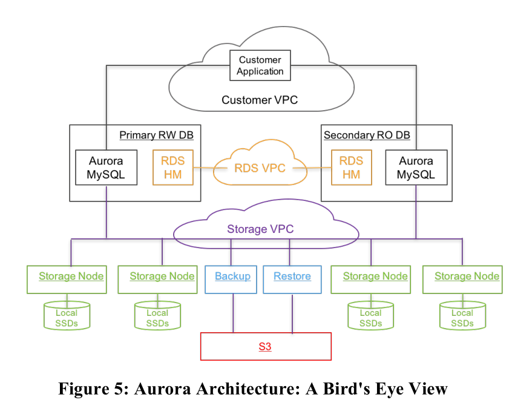
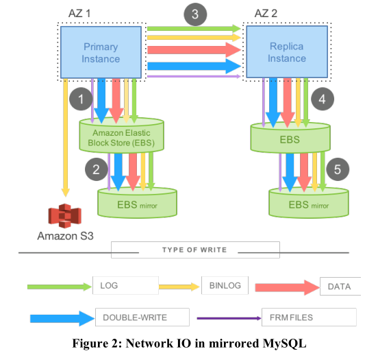
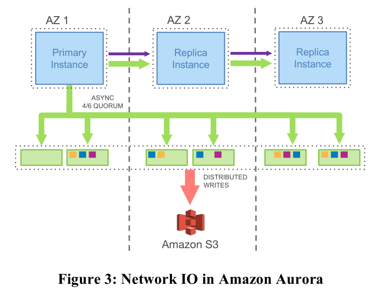
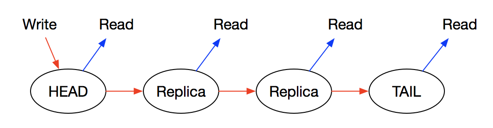
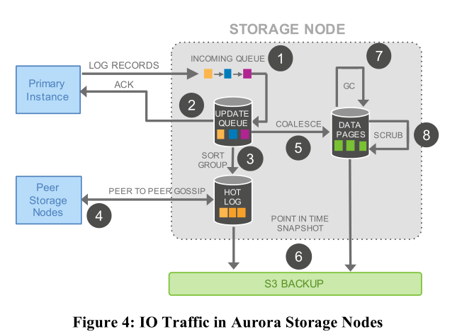

SIGMOD 2017:Amazon Aurora: Design Considerations for High Throughput Cloud-Native Relational Databases
SIGMOD 2018:Amazon Aurora: On Avoiding Distributed Consensus for I/Os,Commits, and Membership Changes
论文阅读

<!-- more -->

### Amazon Aurora: Design Considerations for High Throughput Cloud-Native Relational Databases

-----------

问题：I/O可以分散于各个节点各个磁盘上，所以计算和存储不再是瓶颈，网络开销成为瓶颈

存算分离，***所有节点共享一个存储***

Aurora 通过将 redo 处理过程下推到存储节点，不传数据页只传 log 解决了网络 IO 的问题

#### 主要贡献

做出来一个OLTP关系型数据库服务

1. 通过构建独立的、容错自愈的存储服务，让数据库不受网络层、存储层的性能差异和错误的影响。
2. 只写 redo log 到存储层，大大减少了网络通信。
3. 将数据库中复杂关键的函数，从一次耗时的操作，变成连续异步的操作。因而，我们够做到故障的快速恢复，对前台处理影响小的备份操作。

原来分布式数据库有以下问题

1. 原先数据库瓶颈是计算和存储，论文认为瓶颈是网络开销 ，因为计算和存储可以均分到多个节点，这样导致网络开销巨大
2. 数据库大部分操作可以并行，但是有些情况仍然需要同步，例如cache未命中，线程需要等待硬盘读取完成
3. 事务提交也有可能有影响。一个事务延迟提交，其他事务跟着等待。如分布式环境下，2pc，这些协议不能容错，但是分布式环境，错误是常见的。

--------

- LSN：log sequence number，相当于Log的自增主键，类似于Raft中的Index

- VPC：virtual private cloud，相当于信息交流网络
- RDS：relation database service
- HM：host manager 负责资源调度
- PG：protection group，在不同的replica上的相同segment组成一个PG

### 整体架构

-------------

Aurora负责处理关系型数据库的服务，即RDS，并且primary RW DB用于处理读写请求，secondary RO DB用于处理读请求。

用户应用通过customer VPC接入，可以读写位于不同AZ的数据库，不同的AZ分布于不同的region，用户请求发送到primary RW DB中时，如果是写请求，则发送相关信息给secondary RO DB备份，同时写入存储。如果是读操作，直接从相应存储节点读取。

每个Aurora配置6个存储节点，其中两个用S3备份，剩余4个存储在本地

-----

#### 可扩展持久化

**Quorum模型** 

1. V~r~+V~w~>V, V~w~>V/2
2. 一般部署于3个AZ上，每个AZ两个replica
3. 模型保证任意两个replica故障时有读写能力，一个AZ+一个replica故障也就是3个节点故障可提供读能力，重新复制一个存储节点就可以有写功能

**分段存储**

数据分片把storage volumn拆分成segment存储，快速恢复数据，由aurora确定故障分片位置，从PG中复制正确分片，以减少数据恢复时间

#### 日志处理

**经典mysql架构的网络I/O问题**

网络延迟过高，传统的Mysql写操作时经历5步

1. 主节点写入EBS1
2. EBS1将备份写入EBS2
3. 主节点将数据发给从节点
4. 从节点写入EBS3
5. EBS3将备份写入EBS4

上述步骤1，3，5必须是串行的，增加了延迟，可能中间步骤存在等待，并且传输数据时有很多额外信息，增加了网络I/O

**Aurora I/O架构**

链式复制，而非主从复制，简化了保证数据库一致性的复杂度，在文中提到提供服务的副本不会太多，所以链式复制很有效。

写操作只能在头结点进行，并且按链复制到尾结点。只有尾结点写成功了，头结点的写请求才返回（Committed），读操作可以在任意结点进行。

文中提到最高只会有15个replica

当AZ1的主节点收到写请求的时候，将请求的相关日志发送到6个存储节点，然后通过链式复制将日志及元信息数据发送给从节点即可，这样对比发现

- 主从节点之间信息传输从5种降低为两种，网络通信数据降低
- 节点和存储之间传输的数据变为一种，传输数据量也大大降低
- 主节点来写存储，从节点接收了log后无需操作，减少了原本架构的第4，5步的时间
- 原本mysql架构的两级EBS存储变为一级Quorum代替，两级存储消耗时间为两次存储的和，一级quorum存储时间为最长的时间

----------

#### 存储节点

当主节点将redo log发送给存储节点后，在存储节点的执行流程如下

1. 存储节点通过Incoming Queue接受主节点的Log。
2. 存储节点将Log存到本地硬盘后向主节点发送ACK，用以确认Quorum。
3. 由于网络的不可靠和Quorum机制，当前存储节点可能缺失了部分Log。在这一步，它将Log排序并找出缺失的Log。
4. 通过和其他存储节点进行交换信息，将缺失的Log复制到本地，将所有Log填充完整。
5. 到目前为止，系统中存储的仍是Log而非用户需要数据，这一步执行Log对应的操作，并写入数据库中。
6. 定期地将数据存为快照并存入Amazon S3中。
7. 定期地进行垃圾收集，删除过期数据。
8. 用CRC定期检验数据。

-----

- LSN：Log Sequence Number，相当于Log的自增主键，类似于Raft中的Index。
- VCL：Volume Complete LSN，受到Quorum承认的最大LSN。
- CPLs：Consistency Point LSNs，单个存储节点中已经收到ACK的最大LSN，所以每个节点各一个
- VDL：Volume Durable LSN，已经持久化最大的LSN，也就是CPLs中最大的LSN
- SCL：Segment Complete LSN，由每个段维护，代表段中已经持久化的最大LSN

## Aurora

share disk的架构可以把存储层看成一个黑盒，所以在计算层不存在分布式事务，在计算层将读写集处理，将redolog使用quorum协议同步。Log的完整性通过Log Sequence Number(LSN)等参数判断实现。

存储支持分布式的事务并没有通过2PC, 而是通过gossip+Quorum 机制来保证每个存储节点的完整性。

冲突处理在计算节点。

和我们架构的异同点

## Aurora多主

在多主集群中，管理连接需要知道每个连接使用哪个数据库实例。这样一来，对特定数据库或表的修改始终可以路由到相同的数据库实例。每个数据页面的所有更改都由一个特定实例进行。

在页面级别检测冲突。由于来自不同的数据库实例的建议更改会修改页面中的不同行，因此可能会发生冲突。系统中引入的所有页面更改都将进行冲突检测。

## 异同点

都是share disk，但是Aurora使用redolog+quorum+gossip实现一致性。我们使用2PC就会对参与的节点和网络要求很高，自身容错能力也有限，这和大规模分布式云环境是否矛盾

我们需要在存储作为参与者进行执行分布式子事务，为什么我们不将读写集在计算层直接计算出冲突然后处理掉，跨域merge也在计算层，发送给存储层的是无冲突的事务

计算层所在位置

