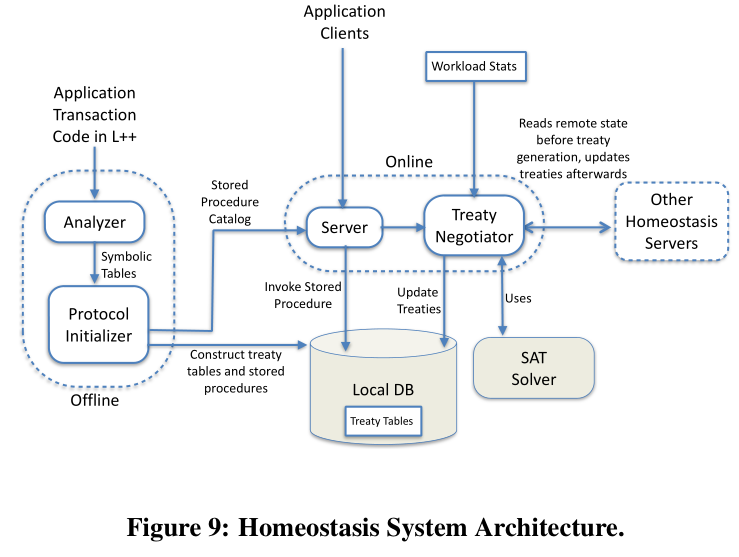

阅读**The Homeostasis Protocol: Avoiding Transaction Coordination Through Program Analysis**论文笔记

<!-- more -->

# **贡献**

实现强一致性的同时减少通信开销的新方法

关键点在于通过预先制定的方法去允许节点状态在执行过程中不一致

强一致性和延迟权衡，目前大多用 高可用，低延迟，异步传播更新来完成最终一致性

论文通过分析应用程序的应用场景来规范，权衡延迟和强一致性

​    

1.分析事务代码的技术(分析事务成为symbol table)

2.使用符号表来执行事务，避免节点通信

3.基于现有工作量生成本地条约的算法

## **事务分析技术**

算术表达式e，布尔表达式b，指令c，事务T，参数p

​    

   

## **Homeostasis协议**

要求提前知道事务的代码

a图 x的数据位于另一个节点，在这个site可以使用保存在该节点旧版本的x，我们只需要增加一个条约保证x的主节点值不会从正更改为负，或者由负值改为正即可。

b图，x数据位于另一个节点，在这个节点可以使用保存在这个节点旧版本的x，我们只需要先判断y是否等于1，如果y=1，那么如果本地x大于10就可以先写入z，那么当x主节点没有把x从比10大改为比10小，这个就无需回滚，如果y不等于1，那么如果本地x大于100，也可以先写入z，那么当x主节点没有把x从比100大改为比100小，这个就无需回滚

协议分三阶段

1.条约产生（Treaty generation）

2.正常执行（在那个时间段执行条约）

3.清理 在这个阶段将所有更新广播给所有节点

### **条约生成算法**

Global Treaty是local treaty的全集

三步骤：

1.预处理全局条约

2.为本地条约生成模板

3.运行优化将本地条约模板化

#### **案例**

​    

#### **offline组件**

用于分析应用程序事务代码

**分析器** 计算符号表

**协议初始器** 设定条约表，会在online组件中更新

#### **online组件**

接收客户端的事务执行请求并与其他服务器协调，来建立维护条约

相当于把事务是否更新数据的条件给记录到每个节点，而不用每次更新都去同步数据

我感觉局限性很大，必须提前知道事务要干什么，然后在数据更新的时候才能根据事务代码来分析这个数据会不会影响事务结果，确定要不要同步数据

但是因为同步只需要在条约被破坏的时候进行，所以节省了很大一部分的时间

## **实验**

**Microbenchmarks**

各线代表意思，homeo代表本文的方式全计算机执行，opt是最优的策略，local是直接本地执行

图10延迟的话，本地执行无延迟，2pc的延迟永远是RTT的2倍，homeo在需要重新计算条约策略时，需要额外的时间计算并且同步。所以最坏情况延迟要比2pc更高一点

图11，吞吐量相比于2pc提高了很多

图12，同步频率，与最优情况相差无几

图13，副本数为变量

​    

**TPCC**

​    

