# Raft

几个相对于paxos的新特点

- Strong leader：日志只能从leader发给其他节点
- Leader election：使用随机计时器选举leader,
- Membership change：使用联合一致性的方法实现成员变更，保证服务再成员变更期间正常执行

## 复制状态机

复制状态机通常用来解决分布式系统中容错问题，通常使用复制日志实现，如图，一个客户端发送命令给服务器集群，通过共识模块，将其存储在日志中并且同步到其他服务器中，这样每个服务器都会存储一份日志，每个服务器的日志存储的都是客户端发来的相同一系列操作，进而通过状态机以一个相同的规则来执行这些相同的操作，这样最终的输出也是一样的。

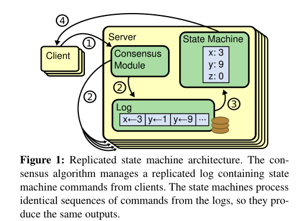

保证日志的一致性就是共识算法要做的事，如上图中的共识模块，做的就是接收客户端的请求，并且把他们添加到日志中。共识模块会和其他服务器上的共识模块进行通信，确保日志最终是以相同的顺序包含相同的请求。

共识算法有以下的特性

- 在非拜占庭模型中保证安全，也就是不返回错误结果
- 高可用，只要大部分服务器可用就可以保证系统可用，一般是需要半数以上服务器可用
- 不依赖时钟顺序保证日志一致性。
- 通常只需要集群中大部分服务器对远程调用响应即可完成命令，少数速度较慢的服务器不影响总体性能

## Raft共识算法

分为三个子问题

- Leader election：领导节点选取
- Log replication：日志复制
- Safety：保证日志的一致状态

### 基础概念

#### 节点状态

- leader：整个集群一般只有一个leader，剩余全为follower，负责接收所有client请求。定期发送心跳包(通常小于选举超时)，如果发现更新Term指令，立刻转为follower
- follower：是被动的，不会主动发出请求，只会回应leader和candidate的请求。在一个随机的超时时间内没有收到投票或者日志复制或心跳包的RPC，就会变成Candidate状态
- candidate：当集群处于选举状态时会出现candidate，用于选取领导节点。处于Candidate状态的节点会立马开始选举阶段，并且投自己一票，然后向其他节点发送投票。如果获得了半数以上的节点投票，那么就转为Leader状态。如果投票给了别的节点，或者发现新的Term时，转为Follower状态。如果选举超时时没有得到半数以上投票，那么则保持Candidate状态，开始新的投票。

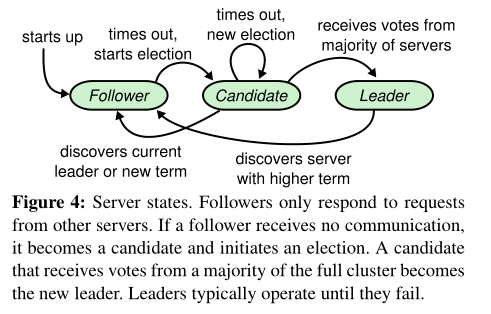

#### Term

每个Term不确定，对term进行连续编号。每次选举阶段开始时，会对Term序号进行推进，Term存在两个阶段，第一个是选举阶段，第二个为选举阶段选出的leader的作用阶段，即一直到触发下次选举领导节点。如果选举阶段出现选出两个leader的情况，直接进行下一个选举阶段，Term也推进。

除此之外，Term还可以作为检查过时领导者的信息，例如网络分区情况下，可能会存在现任leader和旧的无用leader

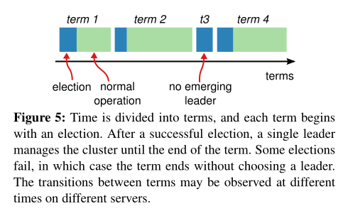

#### RPCs(Remote Procedure Calls)

- RequestVote RPCs：由候选节点在选举leader时发起
- AppendEntries RPCs：由领导节点在同步日志时发起

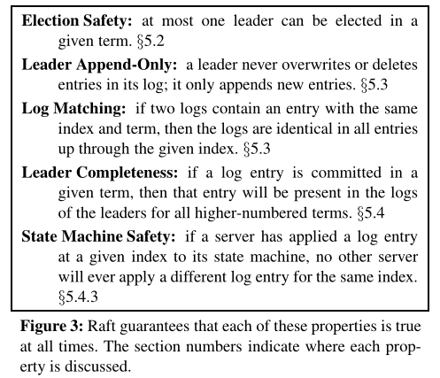

### 领导节点选取

使用心跳机制触发领导节点选取

当follower一段时间后没收到心跳包，就会假设没有leader，开始选举阶段，推进Term，并且变为candidate状态，然后开始投票阶段，向所有节点并行发送RequestVoteRPCs，请求自己成为leader此时存在三种情况

#### 该节点成为leader

收取到半数以上的投票，即成为leader，每个Server只能投票一次，先到先得的原则。一旦赢得选举，就向其他所有节点发送心跳，并建立权限阻止新的选举。

#### 别的节点成为leader

当等待投票结果时，收到了一个领导节点发起的AppendEntriesRPC，如果leader的Term不小于该节点的Term，那就认为其合法，自动变为follower，否则拒绝该RPC，继续选举阶段。

#### 该Term没有leader

可能存在很多candidate，选票可能被分成了很多部分，但是每个部分都不超过半数以上，此时等到选举超时，进行下一次选举，并推进Term。采用随机的选举超时，一般为150-300ms。每次candidate在选举开始时都会重新选择这个超时时间。

### 日志复制

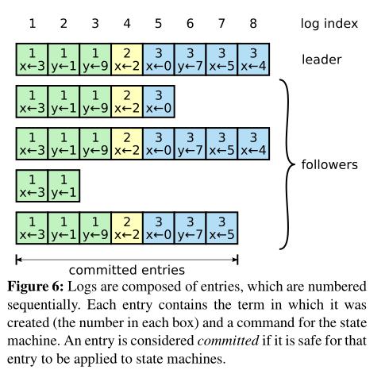

存在Leader时，会响应客户端请求，将客户端传来的命令附加到日志中，然后向其他所有节点并行发送AppendEntriesRPCs来达到复制这个命令的效果。当这条数据被安全复制后，这个leader就会应用所有的数据到状态机并返回结果给client。

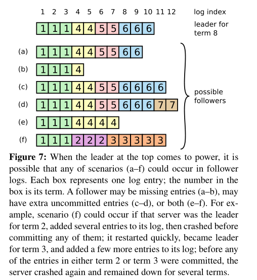

#### 日志复制流程

1. 客户端发送请求给leader
2. leader接收client请求，先将请求作为一个logEntry添加到log中
3. 然后leader再最近的一个心跳包中发送AppendEntriesRPC给Follower节点
4. 一旦日志提交成功
   - 此时日志处于Uncommitted状态，当超过半数节点添加log成功后，则Leader提交该日志给状态机，返回给客户端写入成功
   - 在接下来的AppendEntriesRPC中通知其他节点提交该日志
   - Follower节点提交日志到自己的状态机
5. 如果Leader挂了，其他Follower节点超时后重新选取Leader。如果由宕机或者太慢的Follower节点，则会不断重试选举过程

#### 日志复制的要点

- 不同节点提交的相同的索引和Term的日志项的Command一定相同，并且之前的日志项也都相同
- 如果一个日志项被提交，则它之前索引的所有日志项也都被提交
- Leader不会覆盖自己的日志。其他状态节点如果出现与当前Leader日志不一致，则需要更新日志，包括写入新的日志和删除不一致的日志。
- Leader提交过的日志一定会出现将来新的Leader中
- Leader要保证安全的提交日志，必须满足一下两个提交规则
  - 日志条目已经复制到超过半数以上的Follower节点
  - Leader当前Term的新日志条目至少有一个复制到了大多数Follower节点
- 只能提交当前Term日志

#### 时序性和可用性

Raft的一个特点就是安全性不依赖时序，系统不会因为时序问题而导致错误发生，但是系统的可用性不可避免的会对时序有所依赖。如果服务器崩溃会导致Candidate节点选举不成功而不停的发起选举，而Raft必须有一个稳定的Leader，否则无法工作。领导选举是Raft中对时序要求最关键的地方，Raft能够选举出并保持一个稳定的Leader需要系统满足如下时序要求：

```
broadcastTime << electionTimeout << MTBF
```

其中broadcastTime是指一台服务器并行地向集群其他服务器发送RPC并接收到响应的平均时间，而electionTimeout是选举超时时间，MTBF则是指单个服务器发生故障的平均间隔时间。broadcastTime远小于electionTimeout可以保证Leader持续发送心跳包给Follower节点以防止Follower节点发起选举，electionTimeout远小于MTBF是为了保证系统的稳定运行。Leader崩溃后，理论上大约只有electionTimeout的时间内服务不可用。

根据存储方式的不同，broadcastTime一般设置为0.5ms到20ms(实验中设置心跳间隔略有不同，推荐是100ms左右，我设置的50ms)，而electionTimeout一般是10-500ms(实验设置的是300+ms)。通常服务器的MTBF一般是几个月甚至几年，很容易符合这个要求。

### 安全性

#### 选举条件

- 包含之前所有提交数据的节点才能作为Candidate
- 如果follower的日志比Candidate更新，就会拒绝投票

新旧定义为比较最后一个数据条目的index和Term，Term大的优先

#### 提交旧Term的数据(不安全)

Leader试图从一个较老的任期提交日志，如图所示，在8-c中，S1为Leader，此时为Term4但是仍在提交Term为2的第二条数据，虽然也提交了半数以上的节点，但这是不安全的，因为如果此时S1宕机，S5被选为Leader，那么Term3的数据会将Term2的数据覆盖。

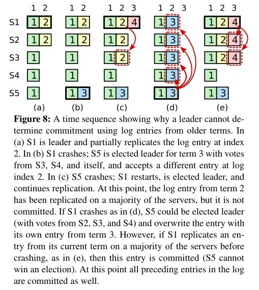

#### 安全提交

**条件**

前一条日志相同才能复制成功，leader最新的Term有日志已经复制到过半数节点当前term才能提交

论文在5.4.3对安全性进行论证

#### Crash

之前的安全性讨论了leader crash时的处理，对于follower和candidate的处理相比较更为简单，即leader发出的AppendEntriesRPC得不到响应，那么进行无限重试即可。因为Raft的RPC是幂等的，所以即使收到多条相同的RPC也不会有影响。

#### 时间选择

Raft要求系统不可以仅仅因为事件发生的比预期快或者慢而产生错误的结果。Raft需要通过设置广播心跳时间还有超时时间来变更leader节点，但是如果心跳时间太长，就有可能因为与某台机器网络通信稍微慢一点就超时，从而导致变更leader，而超时时间太长则会影响性能

一般来说是${BroadcastTime<<ElectionTimeOut<<MTBF}$ MTBF是节点crash的平均时间，在生产中，通常的广播心跳时间是0.5ms到20ms，选举超时时间一般是10ms-500ms，而MTBF是几个月甚至更长

### 成员变更

### 日志压缩

Raft日志在正常操作期间会增长，以合并更多的客户端请求，但是实际使用时，不能不受限制的增长，随着日志的增长，会占用更多的空间，需要更多的时间来replay，如果没有解决机制，就会导致可用性的问题。

其中最简单的就是快照，整个系统的状态写入一个快照，存储在稳定存储中，然后日志清空。Chubby和ZooKeeper就是使用了快照机制。

也可以使用增量压缩方式，如日志清理和LSM树

### 快照

每个Server独立的保存快照，覆盖其中提交后的日志，例如下图当前提交到log index5，那么快照保存必要的信息后，即可删除log index5之前的所有日志。保留的last include index和last include term用于支持AppendEntries中状态的一致性检查需要的PrevLogIndex和PrevLogTerm。

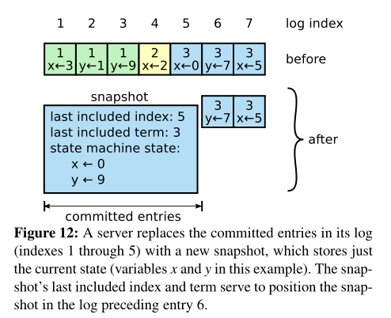

虽然快照是各个节点自己打的，但是leader也会偶尔同步快照给其他节点。也就是Leader当前的log中找不到和follower相匹配的日志了，那么就先直接把快照同步。当follower收到快照时，会进行一些操作

- 通常情况时follower的log还没同步到这一步，这种情况下，直接丢弃所有日志即可
- 如果在Follower的log中找到和last include index和last include term相匹配的日志后，会保留last include index之后的日志，清空之前的日志

现在存在两个问题

- 何时进行快照，如果太频繁，会浪费磁盘的带宽，如果频率太低，又会降低可用性，日志replay太慢，简单的策略就是，日志到达固定大小时打快照
- 打快照的时间太长，影响性能，解决方法就是使用Copy on write

# 总结

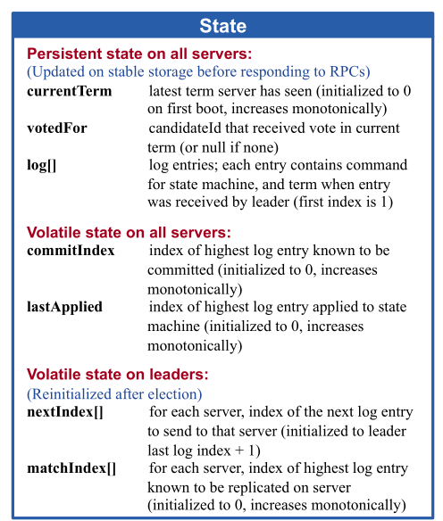

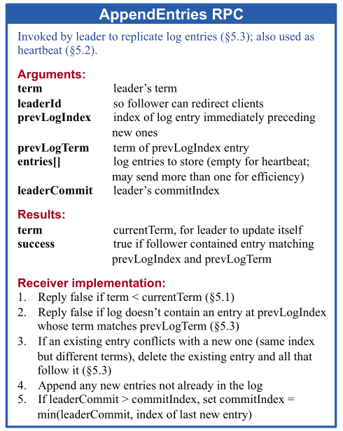


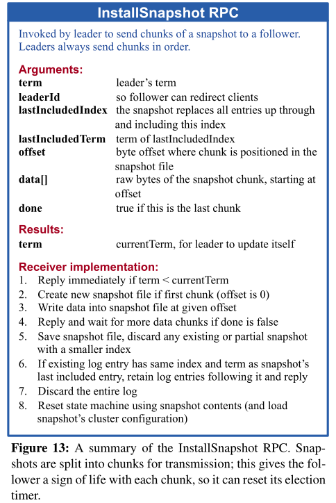

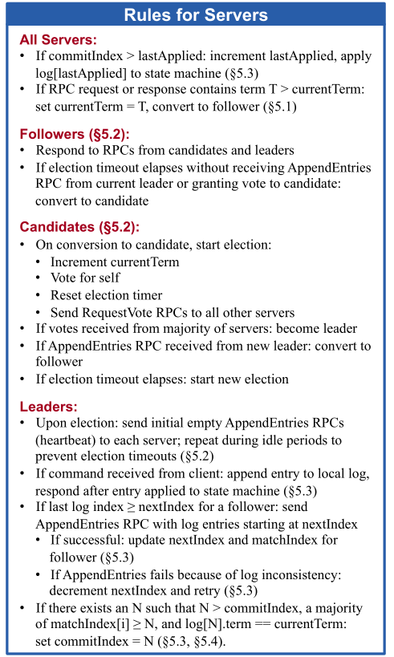


参考：

[1] Diego Ongaro and John Ousterhout，In Search of an Understandable Consensus Algorithm 

[2] Raft算法分析与实现 https://juejin.cn/post/6844903657540943880
