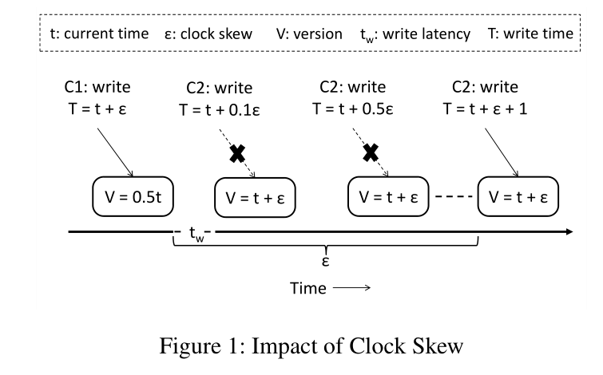
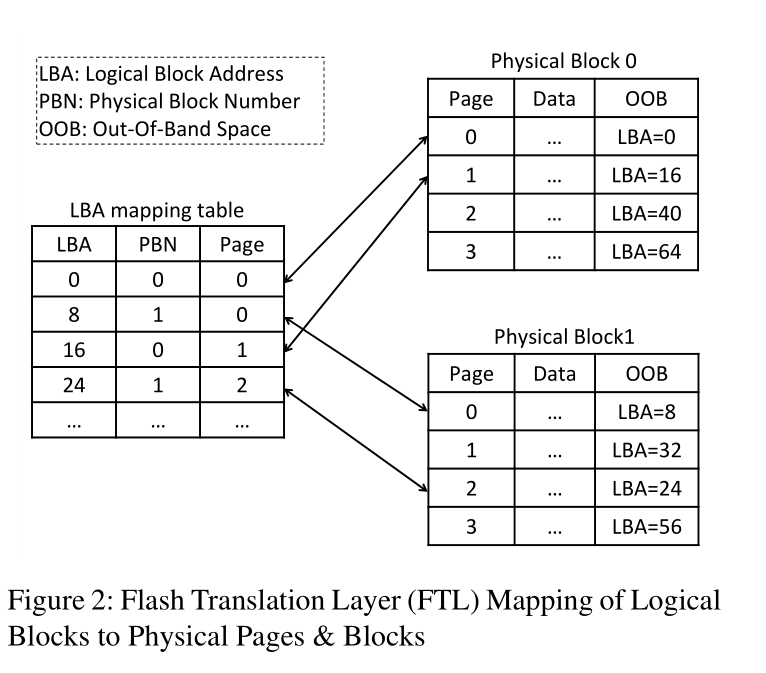
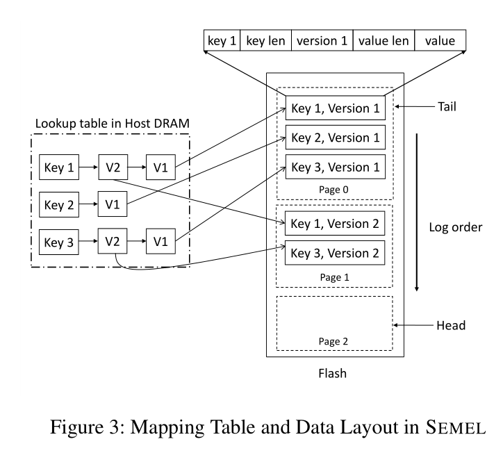
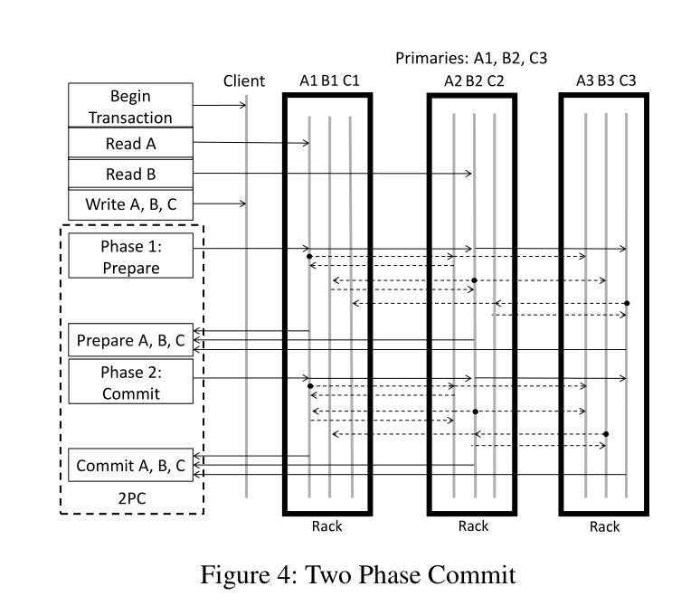
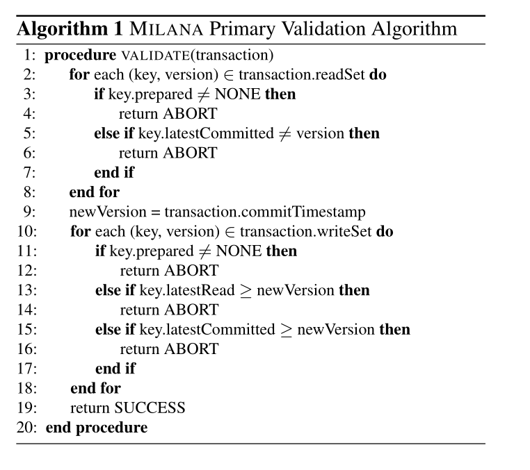
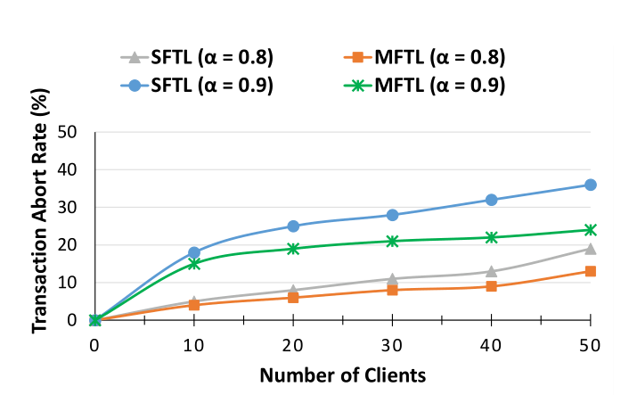
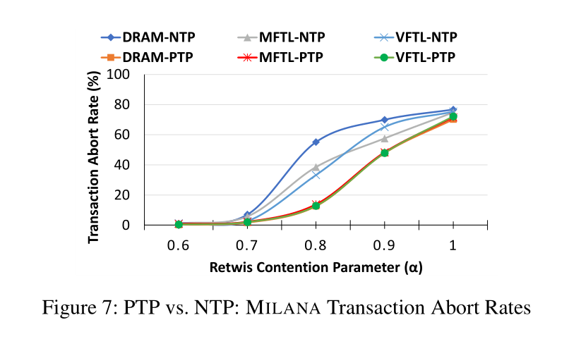

Enabling Lightweight Transactions with Precision Time阅读笔记

<!-- more -->

**如何结合Software-Defined Flash(SDF)和精确同步时钟来提高性能并降低数据中心事务存储的复杂性**

提出分布式事务系统MILANA在多版本key-value store上主要处理读操作工作负载特别大的数据中心

优化了单个数据中心的低延迟访问，使用IEEE的PTP作为全球同步时间，保证服务器时间精确，当时的系统好像用的是NTP

Software-Defined Flash (SDF)

Precision Time Protocol(PTP)

Flash Translation Layer (FTL)

 Network Time Protocol (NTP)

**贡献**

因为OCC事务可能会因为时间戳分配的问题产生冲突，例如，使用PTP就能减少这样的冲突

SEMEL利用闪存SSD写入前重新映射来实现简易版本的多版本存储

Milana快速在本地处理只读事务

PTP将服务器分为主从结构，从服务器可以计算网络延迟以及和主服务器的时钟的偏移量

​    

Clock skew会造成的影响，比如C1的偏移量是一个单位的e，c2的偏移量是0.1个单位，那么又因为我c2是后写的，所以c2是应该成功的，但是因为时钟偏移量问题，我误判版本是旧版本，导致abort，其实这个版本是新的，只不过是因为时间偏移的问题，PTP不能解决这个问题，只能尽量减少这个问题，因为精度更好

​    

左边的是内存中的逻辑地址，右边的部分是SSD的物理地址，每次写入的时候讲逻辑块重新映射到新的物理页面，旧值保存再原处，等待垃圾回收，存多少个版本由垃圾回收这边程序进行判断，利用了centiman中的watermark的思想，把这个watermark之前的版本全回收了就可以。watermark就是在某个时间之前的事务已经全部完成，不会对当前的value造成影响了，所以垃圾回收掉

**SEMEL**

通过ssd实现存储的多版本key value store， 主备结构 replication  

SEMEL的FTL方式Key → LBA → 就能找到对应的最新data

​    

左边的v维护page号和偏移量

每次写入的时候讲逻辑块重新映射到新的物理页面，旧值保存再原处，等待垃圾回收，存多少个版本由垃圾回收这边程序进行判断，利用了centiman中的watermark的思想，把这个watermark之前的版本全回收了就可以。watermark就是在某个时间之前的事务已经全部完成，不会对当前的value造成影响了，所以垃圾回收掉

**MILANA**

分布式事务处理系统，使用OCC，2PC

​    

majority of replica接受了之后，返回确认信息，可以提交，那就进入commit，这就是一个普通的2pc，使用

MILANA primary server maintains in DRAM a latestRead, prepared and latestCommitted timestamp for each active key

key.prepared不等于none 代表有一个事务验证通过

**实验**

​    

多版本的FTL相对于单版本的也是降低了很多的abort率

​    

PTP相比于NTP降低了Abort率
