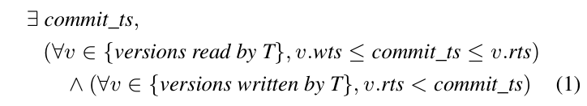
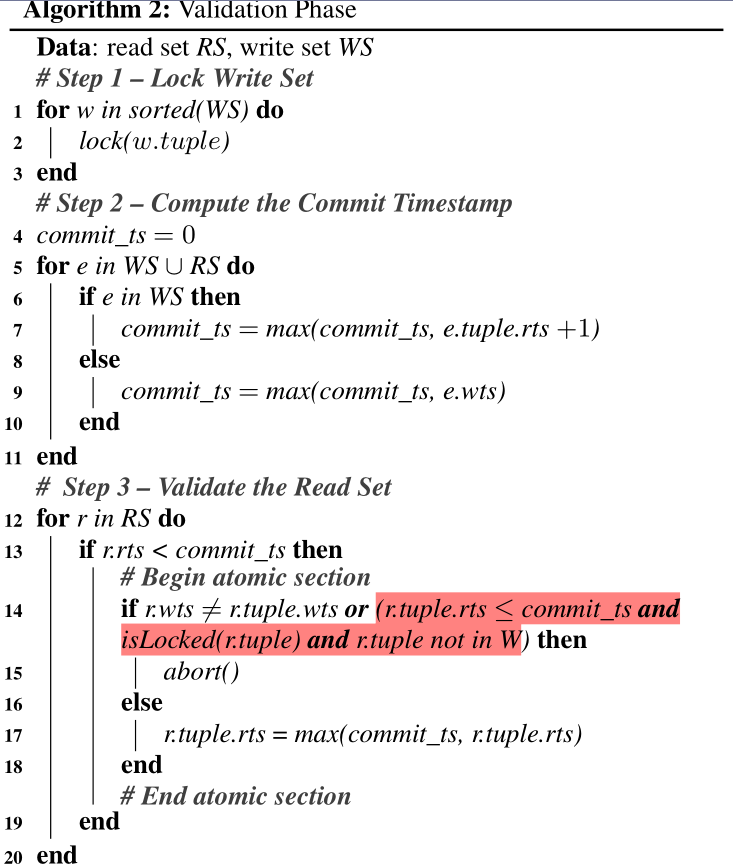
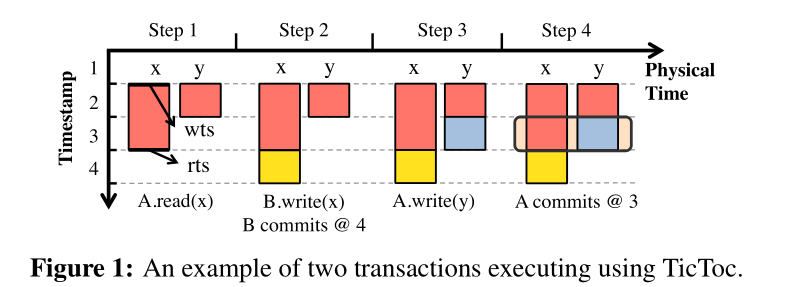

TicToc: Time Traveling Optimistic Concurrency Control阅读笔记

<!-- more -->

**提出Tictoc乐观并发控制算法**

**OCC**

事务三个执行阶段，读阶段，验证阶段，写入阶段

tictoc减少abort次数，和dynamic timestamp allocation(DTA)很像只不过DTA是给一个事务分配时间戳，tictoc是给tuple分配

**TICTOC算法**

两个优点

1.lazy timestamp management减少冲突提高性能

2.高扩展性

每个数据都有一个wts和rts，wts代表记录何时写入，rts代表在[wts, rts]区间都可以读

  

一个事务的读必须是在当前版本数据区间内，一个事务的写，必须等当前版本的可读时间过去

**读阶段**

维护每个事务的读写集

**验证阶段**

按主键顺序锁定写集所有数据记录，计算commit时间，为读集的最大wts和写集中的rts+1最大值的更大值，验证是否被其他事务更改或者锁定

**写阶段**

更新写集中记录的rts和wts为commit时间戳，并且写入数据库，解锁

  

在被其他事务改，但是还没改成功，如果改了之后不冲突

**假abort**

1. A read(x)

2. B write(x)

3. B commits

4. C read(x)

5. C read(y)

6. A write(y)

有个事务C读x和y，这个事务C在B事务提交之后A提交之前发生，这样C看到的是B更改的x以及未更改的y，c的提交时间就要变成x的wts，然后这时候y的rts是1，需要进行扩展，扩展到4，然后A在计算commit时间的时候发现自己的commit时间为5(因为写y,所以是y的rts+1)，在验证阶段会发现x的rts小于commit时间，但是这个x又被B事务改了，无法扩展了，只能abort。但是实际上，这个C事务可以提交
