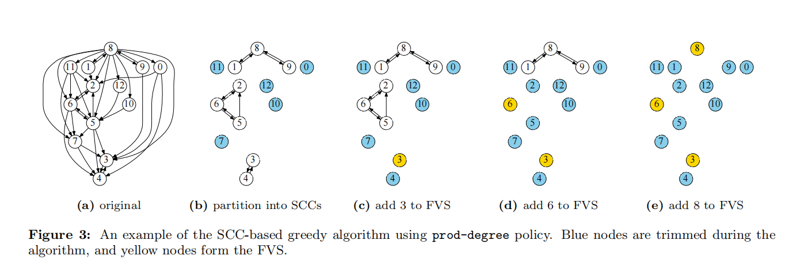
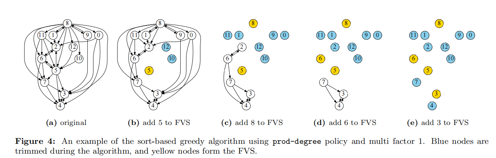

Improving Optimistic Concurrency Control Through Transaction Batching and Operation Reordering阅读笔记

<!-- more -->

# 分层架构

基于OCC的OLTP系统在多个事务执行阶段合并批处理的框架

存储批处理 允许在存储层重新排序事务读写，减少在同一对象的冲突。

验证器批处理 允许在验证之前重新排序事务，减少事务之间的冲突

OLTP系统的吞吐量可以通过batching of operations增加

## **batching可以提高系统性能的原因**

1.网络层通过打包消息来提高通信效率

2.多个请求会被压缩成一个请求来平摊系统调用的开销

3.丢弃重复的或者过失的请求来减少请求数量

Centiman，客户端向系统发出事务，到达系统后每个事务都被分配给一个处理器，并进入读阶段。处理器向storage发送读请求，执行事务，并向本地工作区执行写操作，处理完后，向验证器发送关于事务写的信息，然后进入验证阶段，验证是否与之前提交的事务有冲突，通过验证，处理器将写操作发送到storage，也就是写阶段，否则则abort并重启事务

OCC为batched提供机会，因为事务的最终序列化的顺序仅在提交的时候在验证器中决定。有三个apply semantic batching的机会

1.处理器在事务读阶段，在这个阶段，事务请求可以在执行之前进行batched

2.在验证器中，验证器可以批处理validation request，然后选择一个验证顺序，以此减少冲突和abort的数量

3.batching可以在storage level被完成

# **贡献**

1.展示如何在事务的生命周期内集成批处理和重新排序，以增强基于occ的协议

2.两个greedy算法，用于校验器重新排序平衡中止率和过度

3.batching和reorder可以增加事务吞吐量并且减少事务延迟，尤其是尾部延迟

abort分为两种

1.intra-batch abort 如果事务在一个batch发生冲突，则成为intra-batch abort

2.inter-batch abort 

## **Storage重排序**

问题：如果事务从storage读取对象的老版本，就肯定会在验证阶段abort掉，因为和自己提交事务的更新会发生冲突，因此尽早更新storage layer可减少事务的abort机会

解决：将事务中的大量读写请求缓冲到batch中。当一批请求到达storage layer时，对于每个对象我们都应用最高版本的写请求。然后再处理同一个对象的所有读请求，这样就可以减少intra-batch abort，因为确保了在处理对象的读请求之前，所有提交事务的可用写操作都已经apply了

## **validator重排序**

当事务验证请求到达，我们将其缓存在验证器中，一旦一个batch被收集，验证器就可以通过选择一个好的验证顺序然后有选择性的abort事务来达到减少intra-batch abort。也就是最大限度的增加每个batch的commit的事务数量

IBVR批内验证器重新排序

构造依赖图，每个事务作为一个节点，一条边是一个读写依赖。

**SCC-Based Greedy**：依赖图划分成几个强联通图

具体就是基于SCC的贪心算法，先根据tarjan算法得到所有强联通子图，然后根据你自己的策略来移除节点，然后在剩下的图上递归就可以，直到图上的强联通图没有任何边为止，在例子里他提出的规则就是根据图的入度和出度的乘积大小来排序，先移除乘积大的点加入反馈节点集，这个反馈节点集就是最后排序完之后会被abort的事务。

 **Sort-based greedy algorithm**

根据实验验证，策略排序靠前的很大可能是在FVS中的。所以根据策略进行排序，删除前k个节点，然后在剩余的图上继续迭代，直到图为空

基于排序的贪心算法，就是根据你自己的排序策略来进行排序，依次移除前k个节点，直到图的边为空。

## **三大policy**

A feedback vertex set (FVS) of a directed graph is a subset of vertices whose removal makes the graph acyclic

1.Minimize the number of aborts：减少aborts，减少FVS的大小

2.Minimize tail latency

3.Reduce inter-thread conflicts：我们可以分配事务给特定的线程来减少线程间冲突

### 并行性

因为batch和reorder发生在事务执行期间，可能会增加事务延迟，从而导致冲突的可能性更高，因此需要在验证中引入并行

组件内并行：我的理解是先并行验证之前已提交的事务有没有冲突，然后等靠前的事务提交后继续并行验证。

组件间并行：pipeline

改进-预验证：重排序前，删除与先前提交的事务冲突的事务
