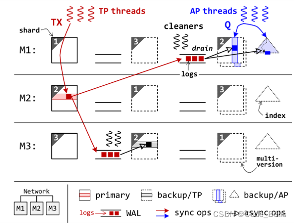
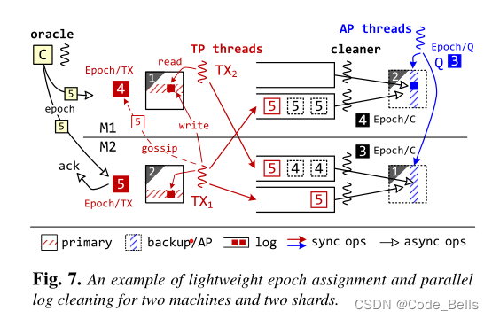
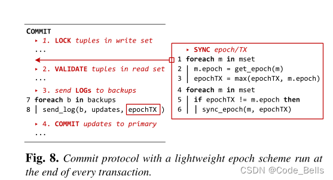
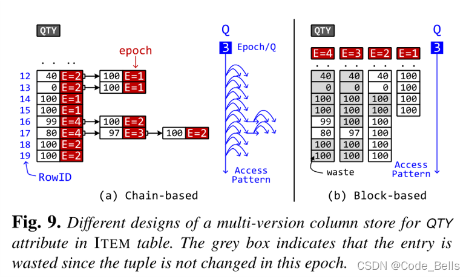
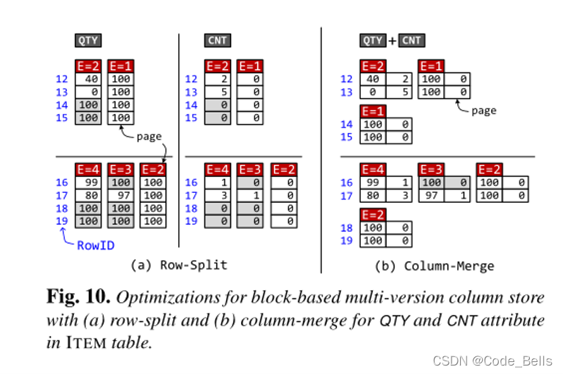
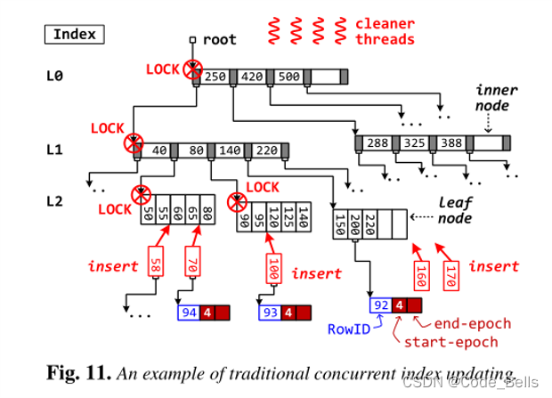
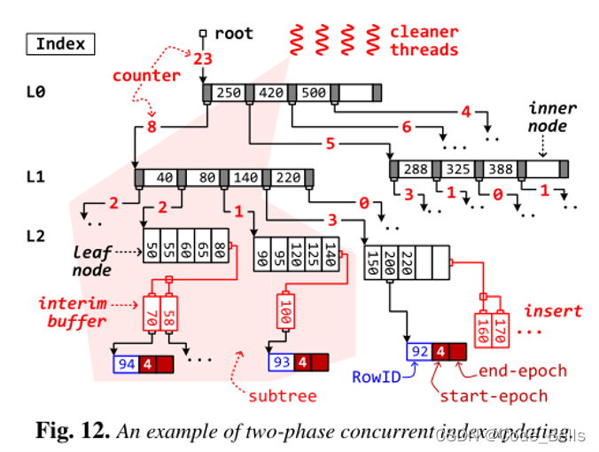

[Retrofitting High Availability Mechanism to Tame Hybrid Transaction/Analytical Processing](https://www.usenix.org/system/files/osdi21-shen.pdf)

 记录一下之前读过的论文。。。

​    怎么说呢，HTAP也算是这几年比较热门的一个讨论方向，HTAP简单来说，就是OLTP和OLAP的混合，一般OLTP系统的实现架构为数据行存储，OLAP系统为数据列存储，简单理解这两个系统，OLTP针对于当前事务处理，一般是需要快速返回最新的结果的应用场景；OLAP针对于历史数据分析，一般是数据量比较大，需要对某些数据进行分析的场景。

​    IPADS发的这篇论文胜在工作量吧，从OSDI 2018的[DrTM+H](https://www.usenix.org/system/files/osdi18-wei.pdf) 基础上，加上了AP系统，对标MonetDB，整合成了现在的HTAP系统，VEGITO，并且TP性能和AP性能也没有明显的降低，该系统注重于HTAP负载时保持稳定性和高性能，以及对数据的Freshness性。

​    这篇论文中比较值得关注的点在于他们TP系统和AP系统的交互过程，如何保证了OLTP系统的性能，也保证了OLAP系统的数据Freshness。

# 系统目标

Freshness：在无故障的情况下，事务的元组值写入和分析查询的读取之间的最大时间延迟应该接近实时，例如几十毫秒。

Performance：与专用系统相比，事务和分析查询应该同时执行，性能下降很少（例如，低于 10%）。

# 主要贡献

改进的容错备份机制
 基于epoch的事务处理技术和日志同步方法
 多版本列存储
 两阶段并发的索引更新

# 架构

整个系统是分片的并且是一主两备，和传统的一主两备不同的是，他的两个备份一个是行存储的backup/TP备份，一个是列存储的backup/AP备份，这么做的目的是为了将AP事务和TP事务分开，AP事务全部放在列存储的AP备份执行，列存储天生适合于做AP事务让他在这边可以有接近于专业AP系统的AP性能，之间只差了一个分发AP事务的时间。而backup/TP只用于备份，对于TP事务，会在主节点被执行。

这种系统和一般的HTAP系统也有区别，他直接将备份节点作为AP事务执行的节点来使用，传统的HTAP系统，也会区分AP事务和TP事务的执行，但是在一个节点上会存放两份数据，即行存储的数据和列存储的数据，但是作为内存数据库来说，这加倍了内存消耗，这是无法容忍的，并且将两个系统整合而不降低太多专用系统的性能也是一个较为困难的过程。

编辑

具体执行流程，首先系统存在两种线程来执行事务，一个是TP线程，执行TP事务，将事务转发到主节点执行，一个是AP线程，执行AP事务，将事务转发到backup/AP节点执行。在执行TP事务时，使用WAL保证高可用性，用预写日志来对backup节点进行数据复制。在主节点提交之前，会先将更新写入每个备份节点的WAL日志再提交事务，然后备份节点通过异步的方式将数据复制。这个异步的数据复制过程由每个backup上的cleaner线程执行。

上述的WAL异步复制数据过程即根据该架构改进的容错备份机制。

# 关键技术

### Epoch及日志同步

通过一个epoch oracle周期性的广播epoch，必须等所有机器都返回ACK，这使得所有机器的epoch差不超过1。这样就可以保证分布式事务的执行顺序，例如图中的例子，TX1分布式事务写数据，TX2依赖于TX1的写，此时M1的epoch比M2低，此时如果为TX2赋epoch更小就出错了，这时候系统将TX1的epoch同步给TX2来避免这种问题。在这里要注意，**并不是说整个系统是以Epoch为粒度执行事务的，而是在同步数据的过程中，是以Epoch为粒度的。**在系统中，是以各自实现为准。引入Epoch只是为了加快同步过程，利用Epoch优化机制提高AP系统的Freshness。

编辑

 除此之外，epoch还有一个作用，在cleaner线程重放日志的时候，可以根据epoch来进行并行复制。其中WAL日志中相同的epoch的可以并行写入数据库，加快数据同步速度，当WAL中当前Epoch的事务全同步后，Epoch/C就会变成当前epoch号。并且在AP线程执行AP事务时不需要等待不同机器的cleaner同步到相同epoch，在查询时，查询稳定状态epoch即可即Epoch/Q，避免阻塞。具体的提交阶段的伪代码如下，很容易看懂。编辑

###  多版本列式存储

​    这个主要是为了避免cleaner线程（写入）和 AP 线程（读取）之间的争用，在epoch级别采用多版本列存储 (MVCS)。传统的MVCS是采用Chain-based的，但是读取模式以及垃圾回收非常费时，VEGITO提出右边的方法，对于每个epoch都维护一个数组。例如图中经过了4个epoch，对于每个epoch执行操作如下，Epoch 1 插入4条100，Epoch 2 更改两条数据为0,40,插入4条100，Epoch 3 更改一条为97，Epoch 4 更改两条为99 80。到了Epoch4每次更改的数据不多，但是所耗空间却是一个单调递增的过程，所以缺点非常致命，对于只增不改的属性非常浪费资源，所以进行了两个优化。编辑

Row split：将值拆分成多个page，实现细粒度的按需数据复制，如果当前没有更新，就不进行数据复制。
 Column Merge：某种类型的事务通常一次更新一组固定的属性，Vegito可以自动发现属性的关联，会将同一个元组的相关属性合并到一个页面。
 ​编辑

###  两阶段并发索引更新

Vegito用的B+树，传统情况并发度很低，如果途中插入70导致节点分裂了，就要锁住整个分裂的树，并且可能产生冗余的分裂操作，而且无用操作会变多，例如插入170后插入160，导致200 220移动两次，170移动一次。这样的冗余操作以及巨大的上锁粒度是我们不能接受的，因为这样会导致并发度大大降低，从而降低系统性能。

编辑

 所以论文提到了两阶段并发索引更新，类似于分布式系统中的两阶段提交吧。听名字就知道，分为两个阶段，第一个Location阶段：定位每个值插入的位置，加入到缓冲区中，并且递归更新计数器的值，代表该子树有多少个节点插入。缓冲区对读操作透明，也就是在缓冲区的数据还没有真正的插入，所以无读写冲突。第二个Update阶段：自顶向下根据计数器来分裂树，避免了冗余操作，并行度就能得到提高。

编辑

分享到这，其实可以看出，整个系统围绕这个架构，提出了一个Epoch同步的优化，然后又围绕Epoch做出了很多针对于数据同步的优化。如果想了解更详细的，可以看看原文。

希望能对大家的科研有所帮助！
